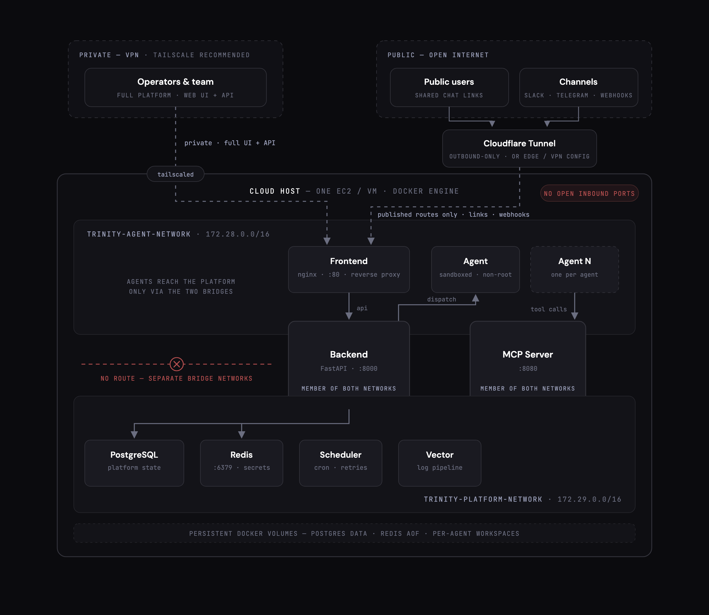

# Trinity Local Development Guide

This guide covers setting up Trinity for local development.

> **Deploying to a server?** Use the [trinity-ops-public](https://github.com/abilityai/trinity-ops-public) ops agent — a Claude Code agent that manages any Trinity instance (health checks, updates, rollback, log triage, provisioning guides for Hetzner / GCP / AWS / DigitalOcean).

## Prerequisites

- Docker and Docker Compose v2+
- 8 GB RAM minimum (recommended: 16 GB for multiple agents)

## Quick Start

```bash
# 1. Clone the repository
git clone https://github.com/abilityai/trinity.git
cd trinity

# 2. Copy and configure environment
cp .env.example .env
# Edit .env with your settings (see Configuration section)

# 3. Build the base agent image
./scripts/deploy/build-base-image.sh

# 4. Start all services
./scripts/deploy/start.sh

# 5. Access the platform
# Web UI: http://localhost
# API Docs: http://localhost:8000/docs
```

## Installing on a server — use the pull-only path (#2280)

**On a server, `--hosted` is the default you want.** The Quick Start above builds
every image from source, and the agent base image alone (Python + Node + Go +
Claude Code, ~1.9 GB) takes 5-10 minutes and wants more RAM than a small VM has
spare. Hosted mode pulls prebuilt images from GHCR instead, so a fresh VM is
serving in roughly two minutes:

```bash
git clone https://github.com/abilityai/trinity.git && cd trinity
cp .env.example .env          # set ADMIN_PASSWORD, ANTHROPIC_API_KEY, ...

# Pin the release you want, in .env — `latest` moves on every Trinity release,
# so an unpinned install turns your next upgrade into an unscheduled one.
# Each release publishes v0.9.0, 0.9.0, 0.9, latest and sha-<short> for the
# same digest, so either version spelling works.
echo 'TRINITY_IMAGE_TAG=v0.9.0' >> .env

./scripts/deploy/start.sh --hosted --unattended
```

`start.sh` reads `TRINITY_IMAGE_TAG` from `.env` (an explicit shell or CI value
wins over it). Put it in the file rather than the environment: `.env` is where
the pin survives a reboot, an unattended re-run, and whoever runs the upgrade
next.

This is the same script, the same `.env` contract and the same
`ADMIN_PASSWORD` behaviour as a source install — only the image source differs.
`--hosted` selects [`docker-compose.hosted.yml`](../docker-compose.hosted.yml),
which is `docker-compose.prod.yml` with the `build:` blocks replaced by GHCR
`image:` references and nothing else changed (a CI guard,
`tests/unit/test_2280_hosted_compose_parity.py`, fails the build if the two ever
disagree on a service, port, volume, network or environment variable).

If a pull fails with `denied` or `unauthorized` rather than `manifest unknown`,
the tag exists but its GHCR package is not public. That is a publishing fault,
not a local one — the release workflow verifies anonymous pullability for every
image it pushes (`Verify anonymous pull` in
[`publish-images.yml`](../.github/workflows/publish-images.yml)), so a red step
there is the signal; report it rather than working around it with a login.

**Minimum size: 8 GB RAM.** Below that the agent containers and the platform
services contend and turns start failing under load.

**Converting an existing source install in place is not a drop-in.** The dev
stack keeps `/data` in the named volume `trinity-data`; hosted (like prod) binds
`${TRINITY_DATA_PATH:-./trinity-data}`. They are different stores, so `--hosted`
in a checkout that has been running `docker-compose.yml` would come up on an
empty database and migrate from zero while the real one sat in the volume —
with Redis, which the two stacks share, not reset. `start.sh --hosted` detects
this and refuses with the copy command rather than starting; run that, then
re-run.

**Run `start.sh --hosted` to upgrade, not a bare `docker compose pull`.** The
agent base image is not a compose service — the backend creates agent containers
through the Docker SDK from the local tag `trinity-agent-base:latest` — so the
script pulls it and retags it separately. A plain `docker compose -f
docker-compose.hosted.yml pull` updates the four platform images and silently
leaves every agent on the old runtime.

Useful commands on a hosted install (note the explicit `-f` — hosted opts out of
compose's default file merge):

```bash
docker compose -f docker-compose.hosted.yml logs -f backend
docker compose -f docker-compose.hosted.yml stop     # 'stop', never 'down'
```

### The shape you are building toward



One host runs everything as Docker containers on two isolated bridge networks —
agents have no route to Redis or the platform database. Operators reach the full
UI + API over your VPN (Tailscale recommended); public users and channel
webhooks reach only the routes you publish through an outbound tunnel, so the
host opens no inbound ports. The table below is how you pick that public edge.

### TLS on a bare VM

Trinity serves plain HTTP and terminates TLS **outside** the application. There
is no HTTPS listener in the compose file and no auto-certificate step, so pick
one of these before putting an instance on a public address:

| Path | What it gives you | When to use it |
|---|---|---|
| **Tunnel** (Cloudflare Tunnel — set `TUNNEL_TOKEN` in `.env`) | HTTPS at a real hostname, no inbound ports open at all | The default for a public instance. Nothing to renew. |
| **Private network** (Tailscale / WireGuard / VPC) | Encrypted transport, instance not on the public internet | What the managed fleet runs. HTTP over a WireGuard tunnel is encrypted — this is a finished posture, not a compromise. |
| **Reverse proxy you run** (Caddy / nginx + Let's Encrypt) | HTTPS at your own domain | You already operate a proxy, or you need a domain the tunnel can't serve. |

Plain HTTP on a public IPv4 with none of the above is the one combination to
avoid: credentials and JWTs cross the network in the clear.

The `cloudflared` service is **profile-gated** (`profiles: ["tunnel"]`), so it
does not start just because `TUNNEL_TOKEN` is set. `start.sh --hosted` activates
the profile for you when the token is present; any other invocation needs it
passed explicitly:

```bash
docker compose -f docker-compose.hosted.yml --profile tunnel up -d
# or: COMPOSE_PROFILES=tunnel docker compose -f docker-compose.hosted.yml up -d
```

Check it actually came up — `docker ps | grep cloudflared`. A missing tunnel
container is silent, and leaves the instance in exactly the plain-HTTP state
this table says to avoid.

A marketplace droplet (#2281) is a special case — it comes up on a bare public IP
with no domain, which is why that channel provisions a Caddy sidecar using
Let's Encrypt's short-lived IP certificates, and why Trinity shows a first-run
hardening guide there (#2380) prompting for a real domain or a VPN. That guide is
gated on install provenance and never appears on an install like this one.

## Configuration

> **Database backend:** Trinity uses **SQLite by default** (zero-config). To run
> a new instance on **PostgreSQL** instead, see
> [POSTGRESQL_SETUP.md](POSTGRESQL_SETUP.md) — it is opt-in via the
> `DATABASE_URL` env var and does not affect the SQLite default (#300).

### Required Environment Variables

Edit `.env` with these required settings:

```bash
# Security - REQUIRED (generate with: openssl rand -hex 32)
SECRET_KEY=your-secret-key-here

# Admin credentials for dev mode
ADMIN_USERNAME=admin
ADMIN_PASSWORD=your-secure-password

# Anthropic API Key - Required for Claude-powered agents
ANTHROPIC_API_KEY=sk-ant-your-api-key
```

### Google API Key (Optional - for Gemini-powered agents)

To use Gemini CLI as an alternative runtime (free tier with 1M token context):

```bash
# Get from: https://makersuite.google.com/app/apikey
GOOGLE_API_KEY=your-google-api-key
```

See [Gemini Support Guide](GEMINI_SUPPORT.md) for details on multi-runtime configuration.

### GitHub Templates (Optional)

To use GitHub-based agent templates (private repositories), add your GitHub Personal Access Token:

```bash
# GitHub PAT for cloning private template repos
# Get from: https://github.com/settings/tokens (classic token with 'repo' scope)
GITHUB_PAT=github_pat_xxxxx
```

**How it works:**
- On startup, the backend automatically uploads the PAT to Redis
- GitHub templates in `config.py` reference this credential
- When creating an agent from a GitHub template, the PAT is used to clone the repo

**Note:** The PAT is stored in Redis with a fixed credential ID (`github-pat-templates`). If you update the PAT in `.env`, restart the backend to sync it to Redis.

### Authentication

Trinity supports two login methods:

#### Email Login (Primary)
Users enter email → receive 6-digit code → login. Configure email provider:
```bash
EMAIL_PROVIDER=console  # console (dev), smtp, sendgrid, resend
```

For local development, use `console` - codes are printed to backend logs.

Manage allowed emails in Settings → Email Whitelist.

#### Admin Login
Password-based login for admin user:
```bash
ADMIN_PASSWORD=your-secure-password
```

## Architecture

```
┌─────────────────────────────────────────────────────────────┐
│                      Trinity Platform                        │
├─────────────────────────────────────────────────────────────┤
│  Frontend (Vue.js)  │  Backend (FastAPI)  │  MCP Server     │
│      Port 80        │     Port 8000       │    Port 8080    │
├─────────────────────────────────────────────────────────────┤
│  Redis (secrets)    │  SQLite (data)      │  Vector (logs)  │
│   Internal only     │   /data volume      │    Port 8686    │
├─────────────────────────────────────────────────────────────┤
│                    Agent Containers                          │
│  ┌─────────┐  ┌─────────┐  ┌─────────┐                     │
│  │ Agent 1 │  │ Agent 2 │  │ Agent N │  ...                │
│  │ SSH:2222│  │ SSH:2223│  │ SSH:222N│                     │
│  └─────────┘  └─────────┘  └─────────┘                     │
└─────────────────────────────────────────────────────────────┘
```

## Data Persistence

| Data | Location | Backup Strategy |
|------|----------|-----------------|
| SQLite (users, agents) | `~/trinity-data/trinity.db` | Regular file backup |
| Redis (credentials) | Docker volume | Redis RDB snapshots |
| Agent workspaces | Docker volumes | Per-agent backup |

### Backup Script

```bash
# Backup database
./scripts/deploy/backup-database.sh ./backups/

# Restore from backup
./scripts/deploy/restore-database.sh ./backups/trinity_backup.db
```

## Troubleshooting

### View Logs

```bash
# All services
docker compose logs -f

# Specific service
docker compose logs -f backend
docker compose logs -f frontend

# Agent container
docker logs agent-myagent
```

### Common Issues

**Agent creation fails**
- Check if `trinity-agent-base` image exists: `docker images | grep trinity-agent-base`
- Rebuild: `./scripts/deploy/build-base-image.sh`

**Stale platform images after a `git pull` (issue #557)**

Symptom: `start.sh` finishes with "Trinity Agent Platform - Ready!", but
the UI shows "Disconnected" and `curl http://localhost:8000/health`
returns connection refused. `docker compose ps` shows `trinity-backend`
as `Up`, yet the backend logs are full of:

```
File "/app/main.py", line N, in <module>
    from <some_package> import <something>
ModuleNotFoundError: No module named '<some_package>'
```

Cause: backend source is bind-mounted from your working tree, but the
**Python environment is baked into the platform image at build time**.
After a `git pull` that adds a new dependency to
`docker/backend/Dockerfile`, `docker/scheduler/requirements.txt`,
`src/frontend/package.json`, or `src/mcp-server/package.json`, the new
source runs against the old image's environment and the import fails.
Compose keeps respawning the crash-looping worker, so port 8000 never
binds.

Fix: rebuild the affected platform images and restart, then `start.sh`
will boot a healthy stack.

```bash
docker compose build      # or: docker compose build backend frontend mcp-server scheduler
docker compose up -d
```

If you frequently pull `dev`, alias this to a single command in your
shell — Trinity does not currently auto-detect the staleness on
`start.sh` because the cost of doing so on every cold start is too high
relative to how rarely the failure occurs (see #557 for the discussion).
A future `scripts/deploy/upgrade.sh` will wrap backup + rebuild + start
+ verify for the explicit upgrade path.

**Redis connection errors**
- Ensure Redis is running: `docker compose ps redis`
- Check Redis logs: `docker compose logs redis`

**Email login not working**
- Check backend logs: `docker compose logs backend`
- Verify EMAIL_PROVIDER is set correctly
- For local dev, use `console` (codes printed to logs)

## OpenTelemetry Metrics (Optional)

Trinity agents can export metrics to an OpenTelemetry collector for external observability tools like Prometheus and Grafana. This leverages Claude Code's built-in OTel support.

### What You Get

| Metric | Description |
|--------|-------------|
| `claude_code.cost.usage` | Cost per API call in USD |
| `claude_code.token.usage` | Token consumption (input/output/cache) |
| `claude_code.lines_of_code.count` | Code added/removed |
| `claude_code.session.count` | Session lifecycle tracking |
| `claude_code.active_time.total` | Active usage duration |

### Quick Start

1. **Enable OTel in your `.env`**:
   ```bash
   OTEL_ENABLED=1
   OTEL_COLLECTOR_ENDPOINT=http://trinity-otel-collector:4317
   ```

2. **Restart the backend**:
   ```bash
   docker-compose restart backend
   ```

3. **Create new agents** - They will automatically export metrics

See `docs/drafts/OTEL_INTEGRATION.md` for full collector configuration and Grafana dashboard setup.

## Security Recommendations

1. **Set `ADMIN_PASSWORD` before first boot — that is what closes the setup window.**
   First-time setup (`/setup` → create the admin account) is **unauthenticated by
   design** so it works on an install that has no admin yet, and it carries **no
   setup token** (removed in trinity-enterprise#49 to keep self-hosted bring-up
   frictionless).

   Since #2381 the endpoint refuses whenever a usable admin account already
   exists — not merely once setup has been "completed", which on a fresh install
   was a flag that said `false` while a real admin sat in the database. So an
   install that boots with `ADMIN_PASSWORD` set is **never** in the vulnerable
   window: the admin is provisioned during startup and the endpoint is closed
   before the first request is served. `docker-compose.prod.yml` makes
   `ADMIN_PASSWORD` mandatory and `scripts/deploy/start.sh` refuses to run
   without one (auto-generating it under `--unattended`), so following either
   path is sufficient.

   The window is still open on an install with **no** admin — a blank
   `ADMIN_PASSWORD`, or a hand-rolled backend — because there the wizard is the
   only way in. Until you create that account, **anyone who can reach the URL can
   claim it.** On such an instance reachable by anyone other than you (a public
   IP, a shared network), keep it behind a **tunnel/VPN or otherwise
   network-restricted** until you have created the admin account. On localhost /
   a trusted LAN this is a non-issue. After setup, login is fully authenticated
   and the window is closed.

   Note the corollary: after a provisioned first boot there is no wizard, so
   binding an admin **sign-in email** is a post-login step in
   Settings → General — the dashboard prompts for it.
2. **Never expose Redis externally** - Keep it internal only
3. **Use strong SECRET_KEY** - Generate with `openssl rand -hex 32`
4. **Use email whitelist** - Restrict access to approved email addresses only
5. **Regular backups** - Automate database backups
6. **Keep Docker updated** - Regular security patches
