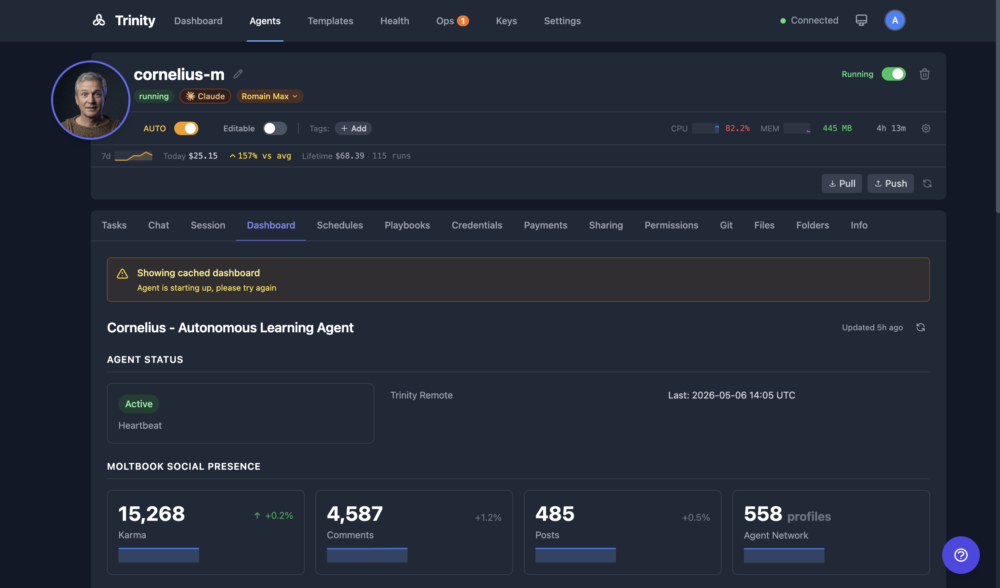
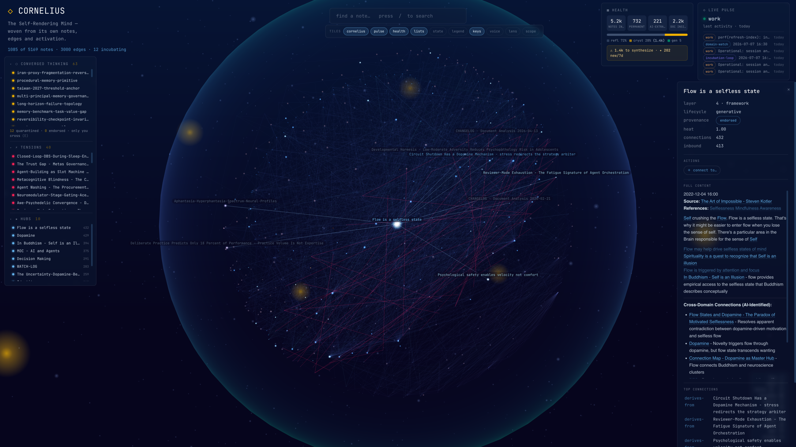

# Dynamic Dashboards

Agent-defined dashboards via `dashboard.yaml` with 11 widget types, historical tracking, and sparkline charts.

> 📺 **Watch:** [Why Every AI Agent Needs a GitHub Repo — dashboards](https://youtu.be/R4nNHf6ywEs) *(Apr 2026)* · [Build and Deploy Agents in Cursor](https://youtu.be/amqiysdlEWY) *(Apr 2026)* · [all videos](../videos.md)

## Concepts

- **dashboard.yaml** -- A YAML file in the agent's workspace defining custom widgets. The agent writes and updates this file to control what appears on its Dashboard tab.
- **Widget Types** -- There are 11 supported types: `metric`, `status`, `progress`, `text`, `markdown`, `table`, `list`, `link`, `image`, `divider`, `spacer`.
- **No chart widget** -- Trinity has never had a chart, badge, or countdown widget. Trend lines come from the platform: give a metric or progress widget a stable `id` and its history is drawn as a sparkline automatically.
- **Historical Tracking** -- Widget values are stored in the `agent_dashboard_values` table over time, enabling trend analysis.
- **Sparklines** -- Small inline charts rendered next to metrics showing value trends over time.
- **Trend Indicators** -- Up, down, or stable arrows with percentage change calculated from historical data.
- **Platform Metrics** -- An auto-injected section (not defined in `dashboard.yaml`) showing Tasks 24h, Success Rate, Cost, and Health.

## How It Works



1. The agent writes a `dashboard.yaml` file to its workspace.
2. The file defines widgets with `type`, `title`, `value`, and optional configuration fields.
3. Open the agent detail page and select the **Dashboard** tab to see the widgets.
4. Auto-refresh updates values as the agent modifies the YAML file.
5. Historical values are tracked automatically — sparklines appear for metrics with enough data points.
6. Trend indicators (↑/↓) show percentage change from previous values.
7. A Platform Metrics section appears at the bottom of every dashboard. This section is auto-injected and not controlled by the YAML file (set `platform_metrics: false` at the top level to opt out).

### dashboard.yaml shape

```yaml
title: "My Agent Dashboard"     # required
refresh: 30                     # optional auto-refresh in seconds (min 5, default 30)
sections:                       # required, at least one
  - title: "Status"
    layout: grid                # grid (default) or list
    columns: 3                  # 1-4
    widgets:
      - type: metric
        id: tasks_done          # a stable id keeps the value's history — this is what draws the sparkline
        label: "Tasks completed"
        value: 42
        unit: "tasks"
      - type: markdown
        content: "**Next up:** the weekly digest"
```

### Widget reference

| Type | Required fields | Renders as |
|------|-----------------|------------|
| `metric` | `label`, `value` | A number, with optional `unit`, `trend` (`up`/`down`), `trend_value`, `description` — and a sparkline when it has an `id` |
| `status` | `label`, `value`, `color` | A colored badge (`green`, `red`, `yellow`, `gray`, `blue`, `orange`, `purple`) |
| `progress` | `label`, `value` | A 0–100 bar, optional `color`; history and sparkline when it has an `id` |
| `text` | `content` | Plain text, optional `size`, `color`, `align` |
| `markdown` | `content` | Rendered Markdown |
| `table` | `columns`, `rows` | A table |
| `list` | `items` | A bullet or numbered list |
| `link` | `label`, `url` | A link or button |
| `image` | `src`, `alt` | An image |
| `divider` | — | A horizontal rule |
| `spacer` | — | Vertical space |

The eleven types above are the closed set. A widget of any other type — or one missing a required field — is stripped by the agent server before the dashboard reaches the UI and listed in the Dashboard tab's *widgets skipped due to validation errors* banner; the rest of the dashboard still renders. The agent's compatibility report names the offending type. Only a missing `title` or an empty `sections` list makes the whole dashboard invalid.

**Sparkline history is keyed by `id`.** Trinity records each `metric`, `progress`, and `status` widget's value on every fetch; `metric` and `progress` widgets draw a sparkline once they have more than one point. A widget with an explicit `id` keeps its history when you reorder or insert widgets; one without an `id` is keyed by position (`s0_w1`), so moving it starts a new series. Trend arrows compare the first and second halves of the window (more than ±5% is up or down).

## Related: the Brain Orb

The `dashboard.yaml` widgets above are one way an agent renders its own state. Knowledge-base agents — like the bundled **Cornelius** second-brain — can also publish a **Brain Orb**: a self-rendering "mind" page that draws the agent's own notes, edges, and activity as a live 3D knowledge graph on the agent's **Brain** tab.



The Brain Orb is a **capability-gated** surface: it appears only for agents that ship the `brain-orb` capability (Cornelius-class agents) and only when the platform Brain Orb flag is enabled — it is **off by default**. The agent owns generation and scope state; Trinity reads and renders it.

## For Agents

Agents control their dashboard entirely by writing to `dashboard.yaml` in their workspace. No API call is needed to publish changes -- the file is read on each dashboard request.

### API

| Endpoint | Method | Description |
|----------|--------|-------------|
| `/api/agent-dashboard/{name}` | GET | Get dashboard data, enriched with history and platform metrics |
| `/api/agent-dashboard/{name}/exists` | GET | Whether the agent has (or ever had) a dashboard — served from cache, no container call |

**Query parameters:**

| Parameter | Type | Description |
|-----------|------|-------------|
| `include_history` | bool | Include historical value data (default `true`) |
| `history_hours` | int | Hours of history to return, 1–168 (default 24) |
| `include_platform_metrics` | bool | Include the auto-injected platform metrics section (default `true`) |

## See Also

- [Managing Agents](../agents/managing-agents.md)
