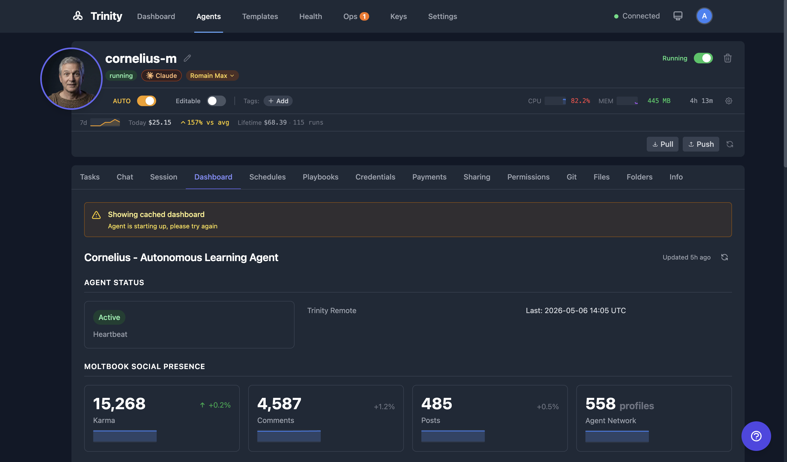
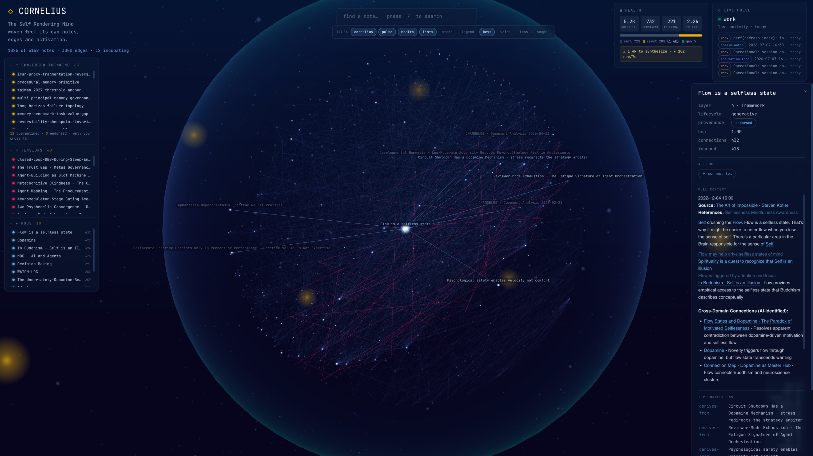

# Dynamic Dashboards

Agent-defined dashboards via `dashboard.yaml` with 11 widget types, historical tracking, and sparkline charts — plus declared business metrics that an agent records as data and that render as tiles with no `dashboard.yaml` at all.

> 📺 **Watch:** [Why Every AI Agent Needs a GitHub Repo — dashboards](https://youtu.be/R4nNHf6ywEs) *(Apr 2026)* · [Build and Deploy Agents in Cursor](https://youtu.be/amqiysdlEWY) *(Apr 2026)* · [all videos](../videos.md)

## Concepts

- **dashboard.yaml** -- A YAML file in the agent's workspace defining custom widgets. The agent writes and updates this file to control what appears on its Dashboard tab.
- **Widget Types** -- There are 11 supported types: `metric`, `status`, `progress`, `text`, `markdown`, `table`, `list`, `link`, `image`, `divider`, `spacer`.
- **No chart widget** -- Trinity has never had a chart, badge, or countdown widget. Trend lines come from the platform: give a metric or progress widget a stable `id` and its history is drawn as a sparkline automatically.
- **Historical Tracking** -- Widget values are stored in the `agent_dashboard_values` table over time, enabling trend analysis.
- **Sparklines** -- Small inline charts rendered next to metrics showing value trends over time.
- **Trend Indicators** -- Up, down, or stable arrows with percentage change calculated from historical data.
- **Platform Metrics** -- An auto-injected section (not defined in `dashboard.yaml`) showing Tasks 24h, Success Rate, Cost, and Health.
- **Declared metrics** -- Business numbers (revenue, close rate, cycles completed) that the agent declares in the `metrics:` block of its `template.yaml` and records with the `record_metrics` MCP tool. Trinity stores each observation as a point and shows the latest value with a freshness verdict. See [Declared Metrics](#declared-metrics).
- **Objectives** -- Targets for declared metrics, set in objective files in the agent's canon. Trinity joins each target to the metric's current value and reports the gap. See [Objectives](#objectives-target-vs-actual).

## How It Works



1. The agent writes a `dashboard.yaml` file to its workspace.
2. The file defines widgets with `type`, `title`, `value`, and optional configuration fields.
3. Open the agent detail page and select the **Dashboard** tab to see the widgets.
4. Auto-refresh updates values as the agent modifies the YAML file.
5. Historical values are tracked automatically — sparklines appear for metrics with enough data points.
6. Trend indicators (↑/↓) show percentage change from previous values.
7. A Platform Metrics section appears at the bottom of every dashboard. This section is auto-injected and not controlled by the YAML file (set `platform_metrics: false` at the top level to opt out).

### dashboard.yaml shape

```yaml
title: "My Agent Dashboard"     # required
refresh: 30                     # optional auto-refresh in seconds (min 5, default 30)
sections:                       # required, at least one
  - title: "Status"
    layout: grid                # grid (default) or list
    columns: 3                  # 1-4
    widgets:
      - type: metric
        id: tasks_done          # a stable id keeps the value's history — this is what draws the sparkline
        label: "Tasks completed"
        value: 42
        unit: "tasks"
      - type: markdown
        content: "**Next up:** the weekly digest"
```

### Widget reference

| Type | Required fields | Renders as |
|------|-----------------|------------|
| `metric` | `label`, `value` | A number, with optional `unit`, `trend` (`up`/`down`), `trend_value`, `description` — and a sparkline when it has an `id` |
| `status` | `label`, `value`, `color` | A colored badge (`green`, `red`, `yellow`, `gray`, `blue`, `orange`, `purple`) |
| `progress` | `label`, `value` | A 0–100 bar, optional `color`; history and sparkline when it has an `id` |
| `text` | `content` | Plain text, optional `size`, `color`, `align` |
| `markdown` | `content` | Rendered Markdown |
| `table` | `columns`, `rows` | A table |
| `list` | `items` | A bullet or numbered list |
| `link` | `label`, `url` | A link or button |
| `image` | `src`, `alt` | An image |
| `divider` | — | A horizontal rule |
| `spacer` | — | Vertical space |

The eleven types above are the closed set. A widget of any other type — or one missing a required field — is stripped by the agent server before the dashboard reaches the UI and listed in the Dashboard tab's *widgets skipped due to validation errors* banner; the rest of the dashboard still renders. The agent's compatibility report names the offending type. Only a missing `title` or an empty `sections` list makes the whole dashboard invalid.

**Sparkline history is keyed by `id`.** Trinity records each `metric`, `progress`, and `status` widget's value on every fetch; `metric` and `progress` widgets draw a sparkline once they have more than one point. A widget with an explicit `id` keeps its history when you reorder or insert widgets; one without an `id` is keyed by position (`s0_w1`), so moving it starts a new series. Trend arrows compare the first and second halves of the window (more than ±5% is up or down).

## Declared Metrics

A `dashboard.yaml` value is whatever the agent last wrote into the file. A declared metric is different: the agent records each observation as a timestamped point, so Trinity holds a real time series and can tell you when the number was last true.

### How declared metrics work

1. The agent declares its metrics in `template.yaml` under `metrics:`. Each entry has a `name`, a `type` (`counter`, `gauge`, `percentage`, `status`, `duration`, or `bytes`), a `label`, and optional fields such as `unit`, `cadence`, `direction` (`up_good`, `down_good`, `neutral`), `aggregation` (`last`, `sum`, `avg`), and `dimensions`. A `status` metric lists its allowed `values`, each with a `color`.
2. Trinity reads that block into a per-agent metric registry. It re-reads it when the agent is created, when a git pull or reset brings in a new `template.yaml`, and when the container starts. An entry Trinity cannot read is dropped and reported as a finding in the agent's compatibility report.
3. The agent records values with `record_metrics`. Each batch is all-or-nothing: if one point is invalid, the whole batch is refused and each bad point comes back with a reason code. A name the registry does not hold is refused with `metric_undeclared`.
4. Open the agent's **Dashboard** tab. A **Declared Metrics** section shows one tile per metric, above any `dashboard.yaml` widgets. The tab appears when the agent has declared metrics, even with no `dashboard.yaml`.

Each tile shows the latest value, formatted for its type (a `duration` of 5400 reads `1h 30m`), and when that point was recorded — relative on the tile, exact on hover. Pick a window (**Auto**, **24 hours**, **7 days**, **30 days**, **90 days**) to change the sparkline range. The tiles read only from the point store, so they show the same numbers when the agent is stopped.

### Freshness

Trinity has one staleness rule: a metric is **stale** when no point has arrived within twice its declared `cadence` (for example `cadence: 1h` or `cadence: 1d`, between one minute and one year). A stale tile keeps its last value and adds a warning chip naming the cadence it missed. It is never shown as current.

| Situation | What you see |
|-----------|--------------|
| Recorded within 2× cadence | The value, with its time |
| No point within 2× cadence | The last value, marked stale |
| No `cadence` declared | The value, with a neutral **No cadence declared** chip — never stale |
| Declared but never recorded | No value yet, with a hint naming the next step |

### Binding a widget to a declared metric

A `metric`, `status`, or `progress` widget in `dashboard.yaml` can name a declared metric instead of carrying its own number:

```yaml
- type: metric
  label: "Revenue"
  metric: revenue      # a name from template.yaml metrics:
  value: 0             # placeholder for agents on an older base image
```

Trinity fills the widget's value, status color, and sparkline from the recorded points on every read, and marks it stale by the same rule as the tiles. A bound widget whose name is not declared, or whose metric was retired, shows the reason instead of a number. Agents on a base image built before this feature still require a `value:`, so keep a placeholder until the image is rebuilt; Trinity overwrites it whenever the binding resolves.

### Retention and limits

Recorded points are kept for `metrics_retention_days` (default 365; `0` keeps them forever). Each agent may record up to `metrics_daily_point_cap` points per UTC day (default 100,000; `0` is unlimited), and up to 1,000 points per call. Both are operator settings (`PUT /api/settings/ops/config`); until a value is saved, `METRICS_RETENTION_DAYS` and `METRICS_DAILY_POINT_CAP` in `.env` supply it. See [Monitoring → Retention Sweeps](../operations/monitoring.md#retention-sweeps).

### Retired: `metrics.json`

Older agents wrote a `metrics.json` file into their workspace. Trinity no longer reads it, and does not fall back to it when no points exist. An agent that still writes one gets a compatibility finding naming the file's keys and which of them are not declared. Declare those keys in `template.yaml`, switch to `record_metrics`, then delete the file.

## Objectives: target vs actual

An objective sets a target for a declared metric. Objective files live in the agent's canon under `objectives/*.yaml` and name each metric by the same `name` as its `metrics:` entry:

```yaml
id: q4-close-rate
statement: Lift close rate to 35% by the end of Q4.
owner: role:revenue-lead
supporting_agents: [sales-companion]
metrics:
  - name: close_rate
    direction: up        # up | down | hold
    target: 35
    by: 2026-12-31
status: active
```

Trinity reads the active objectives the agent owns (through its role) or supports, and joins each metric to its latest recorded value and freshness. Each row reports the target, the actual, whether it is stale, and a gap:

- `gap.status` is **position**, not pace: `behind`, `on_target`, or `ahead` for `up` and `down`; `on_target` or `off_target` for `hold`. It never says whether the agent is late against `by`.
- A stale metric still gets a gap, with `stale: true` beside it.
- An objective naming an undeclared metric shows a finding that names the fix, never a blank.

Objective files are read from the agent's container on each request, so a stopped agent answers `unavailable: agent_stopped`.

## Related: the Brain Orb

The `dashboard.yaml` widgets above are one way an agent renders its own state. Knowledge-base agents — like the bundled **Cornelius** second-brain — can also publish a **Brain Orb**: a self-rendering "mind" page that draws the agent's own notes, edges, and activity as a live 3D knowledge graph on the agent's **Brain** tab.



The Brain Orb is a **capability-gated** surface: it appears only for agents that ship the `brain-orb` capability (Cornelius-class agents) and only when the platform Brain Orb flag is enabled — it is **off by default**. The agent owns generation and scope state; Trinity reads and renders it.

## For Agents

Agents control their dashboard entirely by writing to `dashboard.yaml` in their workspace. No API call is needed to publish changes -- the file is read on each dashboard request. Declared metrics are the exception: record them with `record_metrics`.

### MCP Tools

These tools act on the calling agent's own metrics. An agent-scoped key can read and record only its own.

| Tool | Description |
|------|-------------|
| `record_metrics(points, execution_id?)` | Record up to 1,000 points (`{metric, value, ts?, dims?}`) against declared metrics. A point's identity is `(metric, ts, dims)`: re-sending the same value deduplicates, and a different value at the same identity corrects the stored point in place (reported as `corrected`). Pass `execution_id` so a re-delivered turn replays instead of recording twice. Never throws — refusals come back with a reason code per point |
| `refresh_metric_definitions()` | Re-read `template.yaml` and reconcile the registry after you change `metrics:`. Needs the agent running |
| `get_metrics(metric?, window?, since?, until?)` | Your declared metrics with the latest value, freshness, and a bounded series (up to 120 buckets each). Name one `metric` for its raw points, newest first |
| `get_objectives()` | Your objectives joined to your metrics: target, actual, freshness, and gap. Use it instead of computing a gap from `get_metrics` |

### API

| Endpoint | Method | Description |
|----------|--------|-------------|
| `/api/agent-dashboard/{name}` | GET | Get dashboard data, enriched with history and platform metrics |
| `/api/agent-dashboard/{name}/exists` | GET | What the Dashboard tab would show: `has_dashboard` (a cached `dashboard.yaml`) and `has_declared_metrics`. No container call, so it answers for a stopped agent |
| `/api/agents/{name}/metrics` | GET | Declared metrics with latest values, freshness, and series. `window` = `auto`\|`24h`\|`7d`\|`30d`\|`90d`, or `since`/`until`; `metric` for one metric's raw points; `include_retired`. An undeclared `metric` is a `422 metric_undeclared` |
| `/api/agents/{name}/metrics/points` | POST | Record a batch of points (what `record_metrics` calls). Accepts `Idempotency-Key`. `422` lists a reason per bad point; `429` on the per-minute rate or the daily cap |
| `/api/agents/{name}/metrics/definitions` | GET | The declared-metric registry as Trinity reconciled it (`include_retired` for retired names) |
| `/api/agents/{name}/metrics/definitions/refresh` | POST | Re-read `template.yaml` into the registry. `409` if the agent is stopped; `503` leaves the registry unchanged if the file cannot be read |
| `/api/agents/{name}/objectives` | GET | Objectives joined to metrics: target, actual, freshness, gap, and findings |

**Query parameters:**

| Parameter | Type | Description |
|-----------|------|-------------|
| `include_history` | bool | Include historical value data (default `true`) |
| `history_hours` | int | Hours of history to return, 1–168 (default 24) |
| `include_platform_metrics` | bool | Include the auto-injected platform metrics section (default `true`) |

Full schemas: [Backend API Docs](http://localhost:8000/docs).

## Limitations

- A metric's `type` is frozen once points exist under its name. To change the shape, rename the metric.
- Metric and objective reads are self-scoped for agents: an agent cannot read another agent's metrics.
- Staleness needs a declared `cadence`. Without one, Trinity cannot tell you that a number has gone quiet.
- Objectives are read from the running container, so they are unavailable while the agent is stopped. The metric tiles are not.

## See Also

- [Managing Agents](../agents/managing-agents.md)
- [Monitoring](../operations/monitoring.md) — retention for recorded metric points
- [Agent API](../api-reference/agent-api.md#metrics-and-objectives)
