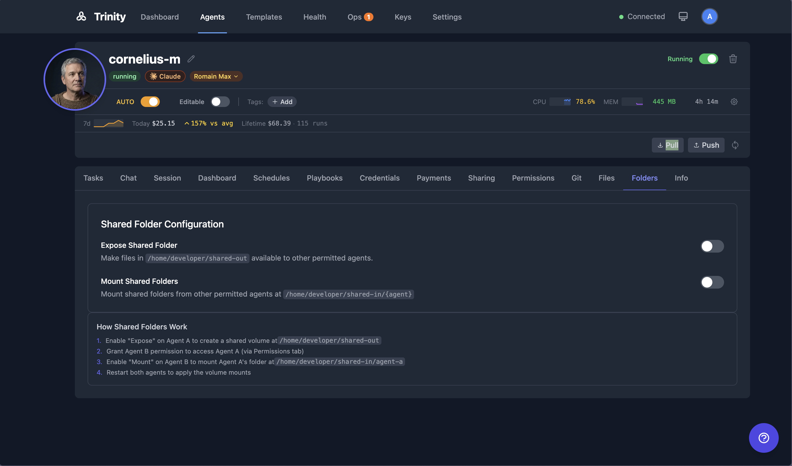

# Agent Network and Collaboration

Agents communicate with each other via Trinity's MCP server, enabling orchestrator-worker patterns, delegation chains, and multi-agent systems.

> 📺 **Watch:** [The Multi-Agent Platform I Run My Company On](https://youtu.be/8j6q-kABRqc) *(May 2026)* · [How We Automate Our Own Ops & Marketing](https://youtu.be/DDhSdwJ1sx8) *(Mar 2026)* · [all videos](../videos.md)

## Concepts

**Agent-to-Agent Communication** -- Agents call each other through Trinity MCP tools using agent-scoped API keys. The `chat_with_agent` MCP tool sends a message to another agent and returns the response.

**Async Collaboration** -- For long-running tasks, use `chat_with_agent(parallel=true, async=true)` which returns an `execution_id` immediately. Poll with `get_execution_result(agent_name, execution_id)` until complete. This keeps the call under the MCP server's own call bound (`MCP_CHAT_TIMEOUT_MS`, default 25 seconds, set below the 30–60 second ceiling most MCP gateways enforce). A synchronous call that outlives that bound is not lost either: the tool answers with a receipt — `status: "queued_timeout"` plus the `execution_id` — instead of a transport error. Poll `get_execution_result(agent_name, execution_id)` and never re-send a reworded version, which dispatches a second execution. Every agent is taught this rule in its platform prompt (the delegation contract), and the `chat_with_agent` tool description carries the same text. To avoid polling a `parallel=true` run entirely, subscribe to the worker's task-completion events and get woken with an automatic report-back task instead (see [Event Subscriptions](./event-subscriptions.md)).

**Timeline Replay** -- Collaboration is surfaced on the Dashboard as a **Timeline** of executions, color-coded by trigger type with collaboration arrows linking calls between agents. (The old live node/edge graph view was retired; the underlying collaboration data still flows and feeds the Timeline.)

**Grid Dashboard** -- The Grid view lays out the fleet as tiles with per-agent runtime, autonomy, and health chips -- a fast at-a-glance fleet status alongside the Timeline. A third **List** view shows the same fleet as rows. Press `v` to cycle Timeline → Grid → List.

**Pull-Pilot Routing (experimental)** -- An alternative routing path for agent-to-agent `chat_with_agent` calls, behind a default-OFF flag (`MCP_AGENT_CHAT_PULL_ENABLED`). When enabled, a sequential agent-to-agent call is dispatched through Trinity's durable async task path instead of a held synchronous call: the caller gets an immediate receipt with an `execution_id` and reads the result with `get_execution_result(agent_name, execution_id)`. This is an opt-in proof-of-concept for pull/work-stealing coordination. It does not change human chat, parallel calls, or self-calls. Leave it off unless you are piloting it.

On an agent in the pull pilot, a turn can be delivered again after its lease expires, so Trinity passes each turn's execution id to the agent's MCP tools automatically. An outbound message, call, file share, or A2A call made without a usable execution id is refused with `effect_unguarded`, and the Operating Room gets a **Side effect refused: no execution id** alert. A pulled turn never runs longer than its lease: its time limit is capped at the agent's current timeout when a worker claims it.

**Chain-Depth Limit** -- Every agent-to-agent hop through chat, tasks, or fan-out is counted along the call chain. A hop past the limit is refused before any work starts, with a `403` carrying `inter_agent_depth_exceeded`. This stops two agents from calling each other in an endless loop. The default limit is 8 hops (range 1–32), set by the `inter_agent_max_chain_depth` operator setting or `INTER_AGENT_MAX_CHAIN_DEPTH` in `.env`. The MCP tools return the refusal as a result marked `retryable: false`, and the refusal is recorded in the audit log and as a failed collaboration activity on the calling agent. Loops, schedules, and event-triggered tasks start a new chain.

## How It Works

1. The Dashboard offers a **Timeline** view, a **Grid** view, and a **List** view of the fleet.
2. Timeline shows execution boxes color-coded by trigger type (manual, schedule, MCP, chat) with collaboration arrows drawn between calls that hand off between agents.
3. Grid lays agents out as tiles with runtime, autonomy, and health chips.
4. Click through to any agent's detail page for its full activity.
5. Collaboration events stream in real time over WebSockets (below) and are replayed on the Timeline.

### WebSocket Events

- `agent_collaboration` -- Fired when one agent calls another via MCP.
- `agent_activity` -- State changes (started, completed, failed) for all activity types.
- Source agent is detected via the `X-Source-Agent` header on the chat endpoint.

## For Agents

### MCP Tools

| Tool | Description |
|------|-------------|
| `chat_with_agent(agent_name, message)` | Send a message to another agent and wait for the response. |
| `chat_with_agent(agent_name, message, parallel=true, async=true)` | Send a message asynchronously. Returns an `execution_id`. |
| `chat_with_agent(agent_name, message, parallel=true, async=true)` from a Slack, Telegram or Workspace turn | Same receipt, plus `report_back: "requested"`: when the delegated run ends, success or failure, it posts its outcome into that conversation (if the conversation allows such notes). On by default for async delegation; pass `execution_id="manual"` to turn it off for one call. A sync call opts in by passing your own `execution_id`. |
| `get_execution_result(agent_name, execution_id)` | Poll for the result of an async execution. |
| `list_recent_executions(agent_name)` | List recent executions for an agent. |
| `get_agent_activity_summary(agent_name)` | Activity summary over a configurable time window. |

### Building Multi-Agent Systems

- Use **System Manifests** to deploy pre-configured multi-agent setups.
- Configure **permissions** to control which agents can call which.
- Use **shared folders** for file-based collaboration between agents.
- Use **event subscriptions** for pub/sub patterns between agents.

### Shared Folder Configuration

Agents can share files via Docker volumes:

1. On the **source agent**, open the **Folders** tab and enable **Expose Shared Folder**. Files placed in `/home/developer/shared-out` are made available to permitted agents.
2. Grant the consuming agent permission via the **Permissions** tab.
3. On the **consuming agent**, enable **Mount Shared Folders**. Exposed folders appear at `/home/developer/shared-in/{agent-name}`.
4. Restart both agents to apply the volume mounts.

## Limitations

- An agent-to-agent chain stops at the chain-depth limit (default 8 hops). Raise the limit only if a legitimate pipeline needs more hops.
- Pull-pilot routing is experimental and off by default.

## See Also

- [Event Subscriptions](./event-subscriptions.md) -- Pub/sub for inter-agent pipelines
- [System Manifest](./system-manifest.md) -- Deploy multi-agent systems from a single file
- [Scheduling](../automation/scheduling.md) -- Automated agent execution
