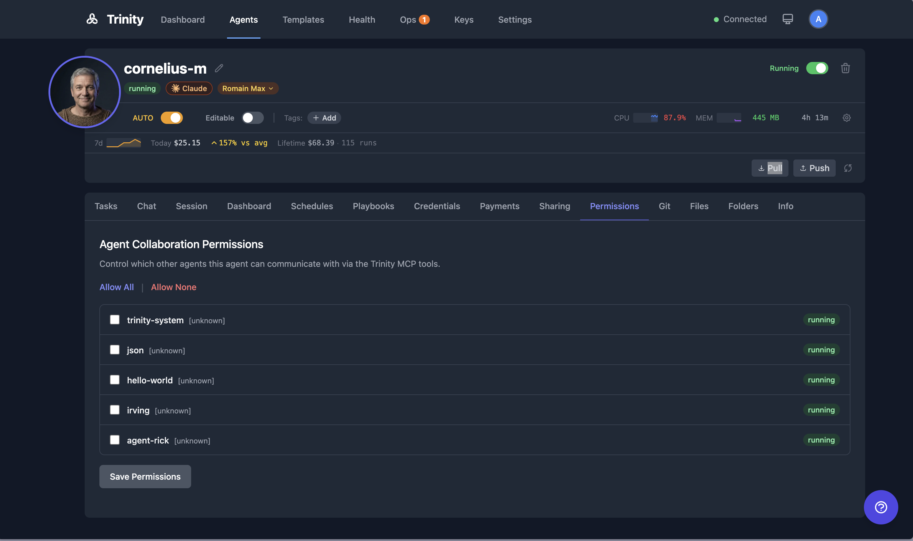

# Agent Permissions

Explicit permission model controlling which agents can communicate with which. Restrictive by default -- no agent can call another without explicit permission.

> 📺 **Watch:** [Trinity Platform Demo](https://youtu.be/ivljtZqsxeo) *(May 2026)* · [all videos](../videos.md)

## How It Works

1. Open the agent detail page and click the **Permissions** tab (located in the agent files/config area).
2. You will see a list of the other agents in the system.
3. Toggle each agent to allow or deny the current agent calling it. **Allow All** and **Allow None** set every row at once. Click **Save Permissions** to apply.
4. Permissions are directional: allowing Agent A to call Agent B does **not** allow Agent B to call Agent A. Each direction must be granted separately.
5. System agents (e.g., `trinity-system`) bypass permission checks entirely.

**Default behavior:**

- No permissions are auto-granted. All inter-agent communication must be explicitly allowed.
- The system agent (`trinity-system`) can call any agent without requiring permission.

**Enforcement:**

- When Agent A attempts to call `chat_with_agent("agent-b", ...)`, the MCP server checks whether Agent A has permission to communicate with Agent B.
- If permission has not been granted, the MCP tool returns an `Access denied` result and the call is blocked. An agent can always reach itself.
- The same check gates starting a loop on another agent (`run_agent_loop`) and reading or stopping that loop (`get_loop_status`, `stop_loop`). See [Agent Loops](../automation/agent-loops.md#permission-checks-on-the-loop-tools).
- Permissions also gate shared folder access and event subscriptions between agents.
- Every blocked call is recorded in the [audit log](../operations/audit-trail.md) as a refusal, so an admin can see which agent tried to reach which.

## For Agents

- Permissions are managed through the agent files/config endpoints. Agents do not need to handle permissions themselves.
- The MCP tools that reach another agent's work check the permission before they run: chat, loops, and the tools that read another agent's schedules, executions, fan-out batches, reports, and operator-queue items. No special handling is required in agent code — read the `Access denied` result and ask the owner for a grant.

## See Also

- [Agent Network](agent-network.md) -- how agents discover and communicate with each other
- [Event Subscriptions](event-subscriptions.md) -- pub/sub messaging between agents (gated by permissions)
