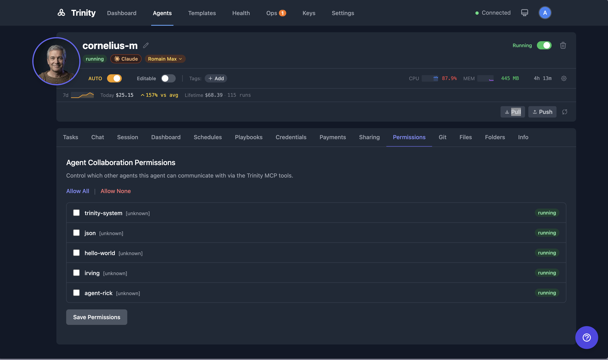

# Agent Permissions

Explicit permission model controlling which agents can communicate with which. Restrictive by default -- no agent can call another without explicit permission.

> 📺 **Watch:** [Trinity Platform Demo](https://youtu.be/ivljtZqsxeo) *(May 2026)* · [all videos](../videos.md)

## How It Works

1. Open the detail page of the agent that will *make* the calls and click its **Permissions** tab (next to **Access** and **Sharing**). The tab is shown to the agent's owner and admins, and never on the system agent.
2. You will see a list of the other agents in the system.
3. Toggle each agent to allow or deny the current agent calling it. You can only grant access to agents you can access yourself. **Allow All** and **Allow None** set every row at once. Click **Save Permissions** to apply.
4. Permissions are directional: allowing Agent A to call Agent B does **not** allow Agent B to call Agent A. Each direction must be granted separately.
5. System agents (e.g., `trinity-system`) bypass permission checks entirely.

**Default behavior:**

- No permissions are auto-granted. All inter-agent communication must be explicitly allowed.
- The system agent (`trinity-system`) can call any agent without requiring permission.

**Enforcement:**

- When Agent A attempts to call `chat_with_agent("agent-b", ...)`, the MCP server checks whether Agent A has permission to communicate with Agent B.
- If permission has not been granted, the MCP tool returns an `Access denied` result and the call is blocked. An agent can always reach itself.
- The same check gates starting a loop on another agent (`run_agent_loop`) and reading or stopping that loop (`get_loop_status`, `stop_loop`). See [Agent Loops](../automation/agent-loops.md#permission-checks-on-the-loop-tools).
- Permissions also gate shared folder access and event subscriptions between agents.
- A grant also lets the calling agent read the target's declared metrics (`get_metrics` with `agent` set to the target). These cross-agent reads count against the reader's own rate budget and are recorded in the audit log.
- A permitted call can still be refused if it is too deep in a chain of agent-to-agent calls. See [Agent Network → Chain-Depth Limit](agent-network.md#concepts).
- Every blocked call is recorded in the [audit log](../operations/audit-trail.md) as a refusal, so an admin can see which agent tried to reach which.

### When a withdrawn permission takes effect

Each control re-reads the permission at a different moment, so removing one (or replacing the set with **Save Permissions**) reaches each at a different time:

| Control | Checked | A withdrawn permission stops it |
|---|---|---|
| Calling the agent (`chat_with_agent`, loops, reading its work) | on every call | at the next call |
| Event subscriptions | when the subscription is created, and again on every delivery | at the next event. The subscription itself is kept, so granting the permission again resumes it |
| Shared folders the agent reads from the other agent | when the container is built | at the agent's next start, which rebuilds it without that folder. **Restart the agent to apply it immediately**; until then a running agent keeps the folder mounted |

Turning **Mount Shared Folders** off on the consuming agent works the same way: the next start removes every `shared-in` folder it still has.

## For Agents

- Agents do not need to handle permissions themselves. Granting and withdrawing is **human-only**: an agent-scoped API key is refused on the write routes below, so an agent can never grant itself or another agent access.
- The MCP tools that reach another agent's work check the permission before they run: chat, loops, and the tools that read another agent's schedules, executions, fan-out batches, reports, and operator-queue items. No special handling is required in agent code — read the `Access denied` result and ask the owner for a grant.

**API Endpoints**: See [Backend API Docs](http://localhost:8000/docs) for full schemas.

| Endpoint | Method | Description |
|----------|--------|-------------|
| `/api/agents/{name}/permissions` | GET | The agents this agent may call (any user with access to the agent) |
| `/api/agents/{name}/permissions` | PUT | Replace the whole set (owner or admin; human only) |
| `/api/agents/{name}/permissions/{target}` | POST | Grant one target (owner or admin; human only) |
| `/api/agents/{name}/permissions/{target}` | DELETE | Withdraw one target (owner or admin; human only) |
| `/api/agents/permissions-edges` | GET | Every permission edge between agents you can access, in one call |

Every grant, replacement and withdrawal is written to the audit log.

## See Also

- [Agent Network](agent-network.md) -- how agents discover and communicate with each other
- [Event Subscriptions](event-subscriptions.md) -- pub/sub messaging between agents (gated by permissions)
