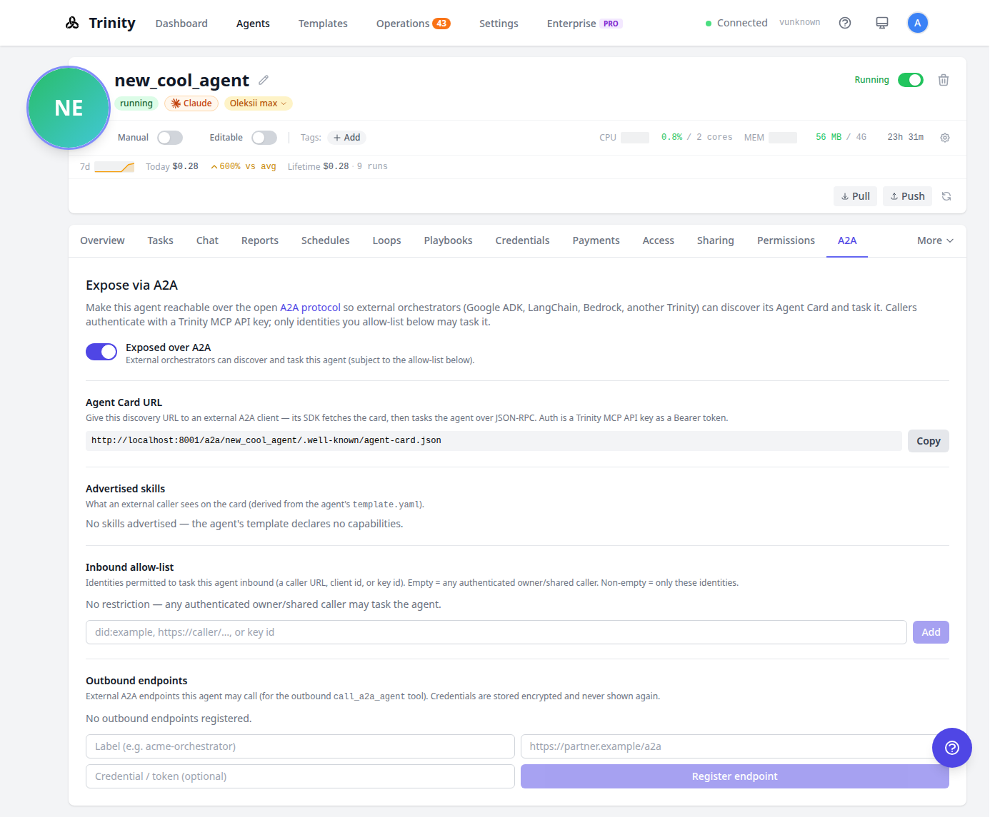
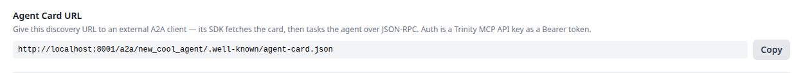

# A2A Protocol — expose & consume agents over Agent-to-Agent

Trinity speaks the open **[A2A (Agent-to-Agent) protocol](https://a2a-protocol.org)**, so an exposed Trinity agent is reachable by any A2A-capable orchestrator — Google ADK, LangChain, AWS Bedrock AgentCore, or another Trinity — and can, in turn, call external A2A agents. To an outside orchestrator, your agent looks like any other A2A agent; it never needs to know Trinity's internal API.

This guide covers both directions:

- **Inbound** — expose one of your agents so external clients can discover its Agent Card and task it.
- **Outbound** — register external A2A endpoints your agent may call.

> **Availability.** Exposing an agent over A2A requires the A2A capability to be enabled (entitled) for your instance. When it isn't, the **A2A** tab is hidden and the public routes return `404` — off and invisible by default. Everything below assumes it's enabled.

---

## Concepts

| Term | Meaning |
|------|---------|
| **Agent Card** | A JSON document (A2A's discovery primitive) advertising the agent's name, skills, endpoint URL, and auth scheme. Generated from the agent's `template.yaml`. |
| **Well-known URL** | The public, unauthenticated discovery URL: `{base}/a2a/{agent}/.well-known/agent-card.json`. This is what you hand to an external client. |
| **JSON-RPC endpoint** | `POST {base}/a2a/{agent}` — the A2A task endpoint (spec v0.3.x): `message/send`, `message/stream`, `tasks/get`, `tasks/cancel`. |
| **Inbound allow-list** | Optional per-agent list of caller account emails permitted to task the agent. Empty = any authenticated owner/shared caller. |
| **Outbound endpoints** | External A2A endpoints (+ optional credentials) your agent may call. |

---

## Part 1 — Expose an agent (inbound)

### Using the web UI

Open the agent's detail page and select the **A2A** tab.



1. **Flip "Expose over A2A" on.** It's OFF by default. While off, the public routes return `404` and the agent is invisible to the A2A ecosystem.
2. **Copy the Agent Card URL.** Once exposed, the panel shows the public discovery URL with a one-click **Copy** button. Hand this to whoever is wiring up the external orchestrator.

   
3. **Review the advertised skills** — exactly what an external caller sees on the card (derived from the agent's `template.yaml` capabilities).
4. **Manage the inbound allow-list** (optional) — add the account emails of callers that may task the agent. Leave it empty to allow any authenticated owner/shared caller.
5. **Register outbound endpoints** (optional) — external A2A endpoints your agent may call, with credentials stored encrypted (never shown again).

### Using MCP (drive it from an agent / automation)

The same controls are available as MCP tools, so you can expose and configure agents conversationally or from a script:

| Tool | What it does |
|------|--------------|
| `get_agent_a2a_config` | Read exposure state, card URL, skills, allow-list, endpoints |
| `set_agent_a2a_exposure` | Toggle A2A exposure on/off |
| `get_agent_a2a_card` | Fetch the served Agent Card JSON |
| `set_a2a_inbound_allowlist` | Add/remove inbound identities |
| `register_a2a_endpoint` / `list_a2a_endpoints` / `remove_a2a_endpoint` | Manage the outbound endpoint registry |

Exposure and credential operations are **owner/admin and human-only** — an agent-scoped key can't flip its own exposure. Reads use the standard agent-access gate.

---

## Part 2 — Consume an exposed agent (external orchestrator)

Once an agent is exposed, an external A2A client discovers and tasks it in three steps. The examples below use `curl` against a local instance (front door on port `8001`); a real A2A SDK does the same automatically.

### 1. Discover — fetch the Agent Card

```bash
curl -s http://localhost:8001/a2a/new_cool_agent/.well-known/agent-card.json | jq
```

```json
{
  "protocolVersion": "0.3.0",
  "name": "new_cool_agent",
  "url": "http://localhost:8001/a2a/new_cool_agent",
  "preferredTransport": "JSONRPC",
  "capabilities": { "streaming": true },
  "securitySchemes": { "bearerAuth": { "type": "http", "scheme": "bearer" } },
  "skills": [ ]
}
```

`url` is the JSON-RPC task endpoint; `securitySchemes.bearerAuth` tells the client to attach a **Trinity MCP API key** as a Bearer token.

### 2. Authenticate — a Trinity MCP API key

Issue an MCP key from **Settings → MCP Keys** (or the API) and share it with the external client. It's a `trinity_mcp_…` key, sent as `Authorization: Bearer $TOKEN` on every task call; unauthenticated calls fail closed with `401`. The examples below assume you've exported it: `export TOKEN=trinity_mcp_…`.

### 3. Task — JSON-RPC 2.0

**Synchronous (`message/send`):**

```bash
curl -s -X POST http://localhost:8001/a2a/new_cool_agent \
  -H "Authorization: Bearer $TOKEN" \
  -H 'Content-Type: application/json' \
  -d '{
    "jsonrpc": "2.0", "id": 1, "method": "message/send",
    "params": { "message": {
      "role": "user", "messageId": "req-1",
      "parts": [{ "kind": "text", "text": "Summarize today’s sales." }]
    }}
  }' | jq
```

Returns an A2A **Task**:

```json
{ "jsonrpc": "2.0", "id": 1, "result": {
  "id": "zAS45ahu2fwsHG9rwdKxQQ", "kind": "task",
  "status": { "state": "completed" },
  "artifacts": [{ "parts": [{ "kind": "text", "text": "…the answer…" }] }]
}}
```

**Streaming (`message/stream`, Server-Sent Events):** same params, `method: "message/stream"`. You receive a `working` status event, then a final `completed` task event.

**Poll / cancel:** `tasks/get` and `tasks/cancel` take `{ "id": "<taskId>" }` — the `taskId` is the id from the send response.

> **Idempotency.** Re-sending the same `messageId` returns the original task **without re-executing** — safe to retry on a dropped connection.

---

## Inbound allow-list

By default, any caller authenticated as an owner/shared identity for the agent may task it. To restrict further, add identities in the **Inbound allow-list** section. With a non-empty list, only listed identities are accepted; everyone else gets `403`.

**Use the caller's Trinity account email** — the identity Trinity compares against is the calling account's email, falling back to its username when the account has no email. A DID or caller URL will never match, so a list containing only those denies every real caller.

> **The allow-list is a restriction, not a security boundary.** It layers on top of authentication — every caller has already passed the `401` and the owner/shared access check before it is consulted. It also **fails open**: if the policy backend errors, the request is allowed rather than denied, matching Trinity's availability bias. Don't rely on it as the only thing standing between an untrusted caller and the agent; that job belongs to authentication and sharing.

---

## Outbound endpoints

Register the external A2A endpoints your agent is allowed to call (name + URL + optional credential). Credentials are stored **encrypted and never shown again** — the UI only indicates whether an endpoint has one (`🔒 credentialed`). This registry feeds the agent's outbound A2A calls.

---

## Behavior & security notes

- **Safe by default** — exposure is OFF for every agent until you turn it on; a non-exposed or non-existent agent returns a uniform `404` (no way to enumerate which agents exist).
- **Auth is fail-closed** — every task call validates the Bearer MCP key; a bad/missing token is `401`.
- **The front door must reach it** — external clients hit your public URL, not the backend port directly. Trinity proxies `/a2a/` to the backend (nginx in production, the dev proxy locally). Set `PUBLIC_CHAT_URL` so the card's published `url` is reachable from outside your network.
- **Stopped agents** still serve a card (from container labels); tasking a stopped/unreachable agent returns a structured JSON-RPC error, never a 5xx.
- **Every inbound task is audit-logged** (`source=a2a`, with the caller identity).

---

## Reference

### Public routes (per exposed agent)

| Method | Path | Auth | Purpose |
|--------|------|------|---------|
| GET | `/a2a/{agent}/.well-known/agent-card.json` | none | Discovery card |
| POST | `/a2a/{agent}` | Bearer MCP key | JSON-RPC task endpoint |

### JSON-RPC methods

| Method | Purpose |
|--------|---------|
| `message/send` | Send a message, get a Task (synchronous) |
| `message/stream` | Same, streamed over SSE |
| `tasks/get` | Fetch a task's current state |
| `tasks/cancel` | Cancel a running task |

### JSON-RPC error codes

| Code | Meaning |
|------|---------|
| `-32700` | Parse error (body isn't valid JSON) |
| `-32600` | Invalid request (not a JSON-RPC 2.0 envelope) |
| `-32601` | Method not found |
| `-32602` | Invalid params (e.g. no message text) |
| `-32001` | Task not found |

Auth failures are transport-level `401`; exposure/allow-list failures are `404`/`403`.

---

## See Also

- [MCP Server](mcp-server.md) — Trinity's own inter-agent protocol
- [A2A Protocol specification](https://a2a-protocol.org) — the canonical spec
- [a2aproject/A2A](https://github.com/a2aproject/A2A) — reference implementations
