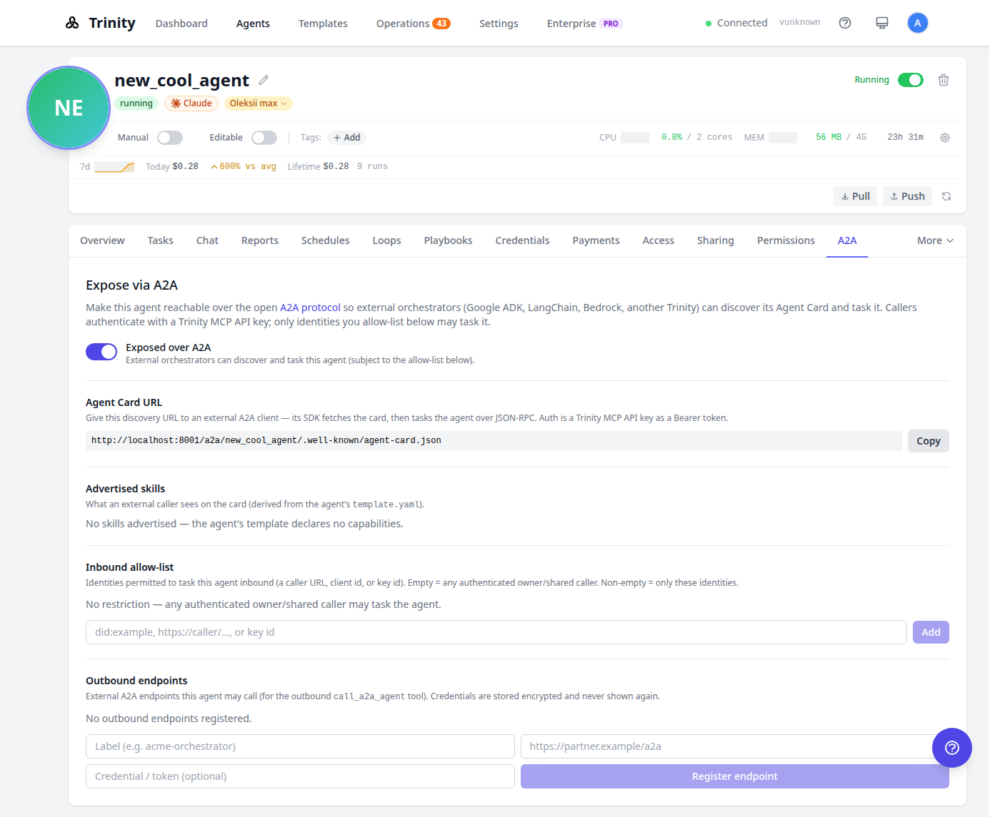
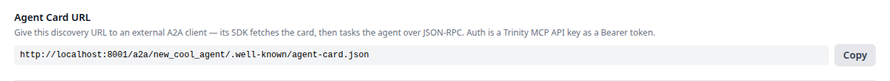

# A2A Protocol — expose & consume agents over Agent-to-Agent

Trinity speaks the open **[A2A (Agent-to-Agent) protocol](https://a2a-protocol.org)**, so an exposed Trinity agent is reachable by any A2A-capable orchestrator — Google ADK, LangChain, AWS Bedrock AgentCore, or another Trinity — and can, in turn, call external A2A agents. To an outside orchestrator, your agent looks like any other A2A agent; it never needs to know Trinity's internal API.

This guide covers both directions:

- **Inbound** — expose one of your agents so external clients can discover its Agent Card and task it.
- **Outbound** — register external A2A endpoints your agent may call.

> **Availability.** The two directions are not gated alike.
>
> - **Inbound** — exposing an agent over A2A requires the A2A capability to be enabled (entitled) for your instance. When it isn't, the **A2A** tab is hidden and the public routes return `404` — off and invisible by default. Parts 1 and 2 assume it's enabled.
> - **Outbound** — calling an external A2A agent, and managing the registry of endpoints your agents may call, works on **every** edition. It has its own switch instead: outbound calling is off until an admin turns it on ([Part 3](#turn-it-on-admin-once)).

---

## Concepts

| Term | Meaning |
|------|---------|
| **Agent Card** | A JSON document (A2A's discovery primitive) advertising the agent's name, skills, endpoint URL, and auth scheme. Generated from the agent's `template.yaml`. |
| **Well-known URL** | The public, unauthenticated discovery URL: `{base}/a2a/{agent}/.well-known/agent-card.json`. This is what you hand to an external client. |
| **JSON-RPC endpoint** | `POST {base}/a2a/{agent}` — the A2A task endpoint (spec v0.3.x): `message/send`, `message/stream`, `tasks/get`, `tasks/cancel`. |
| **Inbound allow-list** | Optional per-agent list of caller account emails permitted to task the agent. Empty = any authenticated owner/shared caller. |
| **Outbound endpoints** | External A2A endpoints (+ optional credentials) your agent may call. |

---

## Part 1 — Expose an agent (inbound)

### Using the web UI

Open the agent's detail page and select the **A2A** tab.



1. **Flip "Expose over A2A" on.** It's OFF by default. While off, the public routes return `404` and the agent is invisible to the A2A ecosystem.
2. **Copy the Agent Card URL.** Once exposed, the panel shows the public discovery URL with a one-click **Copy** button. Hand this to whoever is wiring up the external orchestrator.

   
3. **Review the advertised skills** — exactly what an external caller sees on the card (derived from the agent's `template.yaml` capabilities).
4. **Manage the inbound allow-list** (optional) — add the account emails of callers that may task the agent. Leave it empty to allow any authenticated owner/shared caller.
5. **Register outbound endpoints** (optional) — external A2A endpoints, with credentials stored encrypted (never shown again). Read the note under *[Outbound endpoints](#outbound-endpoints)* before you rely on this panel: it is a **separate, per-agent registry**, and in this build `call_a2a_agent` resolves the platform-wide list of [Part 3](#register-an-endpoint-admin-human-only) instead.

### Using MCP (drive it from an agent / automation)

The same controls are available as MCP tools, so you can expose and configure agents conversationally or from a script:

| Tool | What it does |
|------|--------------|
| `get_agent_a2a_config` | Read exposure state, card URL, skills, allow-list, endpoints |
| `set_agent_a2a_exposure` | Toggle A2A exposure on/off |
| `get_agent_a2a_card` | Fetch the served Agent Card JSON |
| `set_a2a_inbound_allowlist` | Add/remove inbound identities |
| `register_a2a_endpoint` / `list_a2a_endpoints` / `remove_a2a_endpoint` | Manage the **platform-wide** outbound endpoint list — the one `call_a2a_agent` resolves against, and the same list the [Part 3](#register-an-endpoint-admin-human-only) routes manage. `agent_name` is accepted but ignored, because the list is not per-agent |

Exposure and credential operations are **owner/admin and human-only** — an agent-scoped key can't flip its own exposure. Reads use the standard agent-access gate.

The first four tools need the A2A capability enabled; the three outbound-registry tools do not, and work on every edition. Those three are **admin** and human-only — one tier up — because the list they write is platform-wide (see [Part 3](#register-an-endpoint-admin-human-only)).

---

## Part 2 — Consume an exposed agent (external orchestrator)

Once an agent is exposed, an external A2A client discovers and tasks it in three steps. The examples below use `curl` against a local instance (front door on port `8001`); a real A2A SDK does the same automatically.

### 1. Discover — fetch the Agent Card

```bash
curl -s http://localhost:8001/a2a/new_cool_agent/.well-known/agent-card.json | jq
```

```json
{
  "protocolVersion": "0.3.0",
  "name": "new_cool_agent",
  "url": "http://localhost:8001/a2a/new_cool_agent",
  "preferredTransport": "JSONRPC",
  "capabilities": { "streaming": true },
  "securitySchemes": { "bearerAuth": { "type": "http", "scheme": "bearer" } },
  "skills": [ ]
}
```

`url` is the JSON-RPC task endpoint; `securitySchemes.bearerAuth` tells the client to attach a **Trinity MCP API key** as a Bearer token.

### 2. Authenticate — a Trinity MCP API key

Issue an MCP key from **Settings → MCP Keys** (or the API) and share it with the external client. It's a `trinity_mcp_…` key, sent as `Authorization: Bearer $TOKEN` on every task call; unauthenticated calls fail closed with `401`. The examples below assume you've exported it: `export TOKEN=trinity_mcp_…`.

### 3. Task — JSON-RPC 2.0

**Synchronous (`message/send`):**

```bash
curl -s -X POST http://localhost:8001/a2a/new_cool_agent \
  -H "Authorization: Bearer $TOKEN" \
  -H 'Content-Type: application/json' \
  -d '{
    "jsonrpc": "2.0", "id": 1, "method": "message/send",
    "params": { "message": {
      "role": "user", "messageId": "req-1",
      "parts": [{ "kind": "text", "text": "Summarize today’s sales." }]
    }}
  }' | jq
```

Returns an A2A **Task**:

```json
{ "jsonrpc": "2.0", "id": 1, "result": {
  "id": "zAS45ahu2fwsHG9rwdKxQQ", "kind": "task",
  "status": { "state": "completed" },
  "artifacts": [{ "parts": [{ "kind": "text", "text": "…the answer…" }] }]
}}
```

**Streaming (`message/stream`, Server-Sent Events):** same params, `method: "message/stream"`. You receive a `working` status event, then a final `completed` task event.

**Poll / cancel:** `tasks/get` and `tasks/cancel` take `{ "id": "<taskId>" }` — the `taskId` is the id from the send response.

> **Idempotency.** Re-sending the same `messageId` returns the original task **without re-executing** — safe to retry on a dropped connection.

---

## Inbound allow-list

By default, any caller authenticated as an owner/shared identity for the agent may task it. To restrict further, add identities in the **Inbound allow-list** section. With a non-empty list, only listed identities are accepted; everyone else gets `403`.

**Use the caller's Trinity account email** — the identity Trinity compares against is the calling account's email, falling back to its username when the account has no email. A DID or caller URL will never match, so a list containing only those denies every real caller.

> **The allow-list is a restriction, not a security boundary.** It layers on top of authentication — every caller has already passed the `401` and the owner/shared access check before it is consulted. It also **fails open**: if the policy backend errors, the request is allowed rather than denied, matching Trinity's availability bias. Don't rely on it as the only thing standing between an untrusted caller and the agent; that job belongs to authentication and sharing.

---

## Charge for inbound A2A calls

If an exposed agent has **Payments** configured (Agent → Payments tab, x402 via
Nevermined), callers without a Trinity key pay to task it over A2A — the same
paywall the paid chat endpoint has always had, now on the A2A door.

**Who pays, and who doesn't:**

| Caller | What happens |
|---|---|
| Another agent in your fleet, you, or anyone the agent is shared with (a valid Bearer MCP key) | Runs **free**, exactly as before. Nothing about your internal traffic changes. |
| A subscription tenant | Unaffected. |
| A stranger, on an agent with payments **off** | `401`, exactly as before. |
| A stranger, on an exposed agent with payments **on** | `402 Payment Required` with what to pay; a valid token runs the task and settles. |

**How an external client pays.** It reads the price off the discovery card, buys
plan credits from Nevermined, and sends the payment in the A2A message's
`metadata` under `x402.payment.payload`. The older `payment-signature` HTTP
header still works as a fallback, and if a client sends both, the one in the
message wins. The reply is a normal A2A Task carrying the payment status and a
receipt: the primary location is **`status.message.metadata`**, which is where
the x402 A2A extension puts it and where payment-aware SDKs read it. The same
object is also mirrored onto the Task's own top-level `metadata`, so a strictly
typed client sees the receipt rather than `metadata: null`. A **free** turn's
Task carries no `metadata` key at all.

**The card tells a client the price before it calls.** An exposed, priced agent's
`/.well-known/agent-card.json` carries a payment entry under
`capabilities.extensions` with the plan id, the credits per call, and a
`paymentInfoUrl` pointing at `/api/paid/{agent}/info` — so a payment-aware client
can pay on its **first** request instead of being refused once to learn the
price. An agent with no payment config has a byte-identical card to before.

> **A price on the card does not mean the door is open.** The card says what the
> agent *costs*; A2A exposure is what makes the paid A2A door reachable. On a
> build without the exposure feature, a configured price block points at a door
> that answers `404` — turn exposure on for that agent to open it.

**Time-based (duration) plans.** Set **Credits per Request** to `0`. A duration
plan charges by time, so Trinity sends no per-call amount and the plan decides
what a call burns; `0` says that honestly rather than claiming a per-call price
nothing will charge. The card then advertises the cost as plan-defined. (A
negative number is rejected.)

**Retrieving a paid result.** If you hold the task id, the payer can poll
`tasks/get` with the same token — a task is bound to the wallet that paid for
it, and any other caller gets the ordinary "task not found". If your HTTP client
timed out before it read the task id, re-send the identical message with the
same token: that replays the completed result instead of re-running (and
re-charging) the work.

**Refusals, and what they mean:**

| Answer | Meaning |
|---|---|
| `401` | No price configured for this agent (or it isn't exposed) — authenticate with a Trinity key. |
| `402` | Pay, then retry. The body and the `payment-required` header say what to buy. |
| `403` | The token was rejected (or your wallet isn't on the agent's inbound allow-list). |
| `429` | Rate limited. The paying path is capped per source address **and** per agent. |
| `501` | Payments are configured but this Trinity install can't process one right now. |

A refusal that is **our** side being busy rather than a verdict on your token —
a payment checker that timed out, or too many payment checks in flight — is not
a `403`. It comes back as a JSON-RPC error carrying `data.retryable: true`, with
a `data.code` saying which case it is (`verify_unavailable` — we could not
check; `in_flight` — your own identical request is still running). Retry those
with the **same** token; never buy another. `payment_rejected` and `not_allowed`
carry `retryable: false`. On `message/stream` the same classification arrives as
an error event, because a status code cannot be sent once the stream has opened.

> **Paid calls are logged as money.** Each settled call records the paying wallet,
> the execution it paid for, and the source address. A delivered turn whose
> settlement fails still returns your result and is reported as unsettled rather
> than as a clean success — Trinity never claims it charged you when it didn't,
> or that it delivered for free when it is still reconciling.

---

## Outbound endpoints

Register the external A2A endpoints your agent is allowed to call (name + URL + optional credential). Credentials are stored **encrypted and never shown again** — the UI only indicates whether an endpoint has one (`🔒 credentialed`).

> **Which list does `call_a2a_agent` actually read?** Trinity resolves an outbound target through a provider seam, and in this build the resolver is the **platform-wide** list you manage in [Part 3](#register-an-endpoint-admin-human-only) — not this per-agent panel. If you register a target here and your agent answers `endpoint_not_found`, that is why: register it in Part 3 — either with the routes shown there or with `register_a2a_endpoint`, which address the same list. This per-agent panel is a separate registry; it becomes the resolver on a build that registers a provider for it, in which case it takes precedence.

---

## Part 3 — Call an external A2A agent (outbound)

Your agents can task *other* people's A2A agents — a Google ADK agent, a LangChain or Bedrock agent, or another Trinity instance — and get the answer back inside a single tool call.

### Turn it on (admin, once)

Outbound calls are **off by default**. Enable them either way:

```bash
# .env, then restart
A2A_OUTBOUND_ENABLED=true
```

…or flip it at runtime with no restart (the stored setting wins over the environment variable):

```bash
curl -X PUT http://localhost:8000/api/settings/a2a_outbound_enabled \
  -H "Authorization: Bearer $TOKEN" -H 'Content-Type: application/json' \
  -d '{"value": "true"}'
```

`GET /api/settings/feature-flags` reports `a2a_outbound_available` so you can confirm it took.

Once a stored setting exists it wins in both directions, and the environment variable is ignored until you clear the row with `DELETE /api/settings/a2a_outbound_enabled`. If `.env` says `true` and the feature still looks off, that stored row is why.

There is **no settings panel** for the endpoint registry — it is an API-only surface. Don't go hunting for it next to the per-agent A2A tab.

### Register an endpoint (admin, human-only)

An agent **cannot supply a URL**. It picks a target by *name* from a list an administrator registered:

```bash
curl -X PUT http://localhost:8000/api/settings/a2a-endpoints \
  -H "Authorization: Bearer $TOKEN" -H 'Content-Type: application/json' \
  -d '{
        "name": "research-partner",
        "url": "https://partner.example.com/a2a/researcher",
        "credentials": "their-api-token"
      }'
```

Registry rules worth knowing before your first attempt:

- **Upsert is by name.** Re-sending the same `name` updates that endpoint. Omitting `credentials` on an update **keeps** the stored secret; send `"clear_credentials": true` to remove it.
- **Credentials must be printable ASCII with no whitespace or line breaks** (≤8192 chars). A token pasted with a trailing newline is rejected with `422` — that is the single most common first-try failure.
- **Up to 50 endpoints**, and each URL is SSRF-validated when you register it *and* re-validated on every call.
- **If the credential is a payment token, say so — or let Trinity notice.** `"credential_kind": "payment_token"` makes Trinity attach it as an x402 payment — the `x402.payment.payload` metadata plus the `payment-signature` header — **in addition to** the `Authorization: Bearer` header every credentialed call already carries, not instead of it. You can leave the field out: Trinity infers it from the value, so a token pasted straight from a paid provider works without you knowing the field exists. The response tells you which it concluded. Send `credential_kind` **alone** (no `credentials`) to re-label a secret you already stored, and note that it cannot be combined with `clear_credentials` — that pair is rejected with `422` rather than guessing which you meant.

```bash
# List them (credentials are never returned — only whether one is set)
curl -H "Authorization: Bearer $TOKEN" http://localhost:8000/api/settings/a2a-endpoints

# Remove one
curl -X DELETE -H "Authorization: Bearer $TOKEN" \
  http://localhost:8000/api/settings/a2a-endpoints/research-partner
```

The URL must be **HTTPS** and must resolve to a public address; Trinity refuses anything pointing inside your network. It re-checks this on **every call**, not just at registration, so a hostname that later resolves somewhere internal stops working rather than being trusted because it was once accepted.

> **⚠ Registering an endpoint is a trust decision, not a configuration step.**
> Trinity removes the literal credential from anything the remote sends back. It **cannot** stop a remote that base64-encodes, splits or otherwise transforms it — and an agent under prompt injection can be talked into asking for exactly that. **Registering an endpoint grants that endpoint the ability to exfiltrate its own credential.** Register peers you would trust with the token you are handing them.

**Owning the agent is not enough.** This registry is **admin and human-only** on every edition. The list is platform-wide, so registering an endpoint hands a credentialed egress target to *every* agent on the instance — a fleet-wide grant rather than one agent's setting, and Trinity keeps grants human-only. An agent-scoped key is refused on all three operations.

The same three operations are available over MCP, so this is not a `curl`-only surface:

```
register_a2a_endpoint(name        = "research-partner",
                      url         = "https://partner.example.com/a2a/researcher",
                      credentials = "their-api-token",
                      # optional — inferred from the value when omitted;
                      # "payment_token" for an x402 token bought after a 402
                      credential_kind = "api_key")      # -> { endpoint, outbound_enabled }
list_a2a_endpoints()                                    # -> { endpoints, outbound_enabled }
remove_a2a_endpoint(endpoint_id = "research-partner")    # id or name; first match wins
```

They need an **admin** key held by a person, and they work whether or not the A2A capability is enabled. `register_a2a_endpoint` reports `outbound_enabled`: when it is `false`, the response also names the one admin step above that makes the endpoint callable — so a registration you cannot yet use says so instead of looking finished. `agent_name` is accepted and ignored.

### When the remote charges for the call

Some A2A agents are priced. Such a remote answers **402 Payment Required**, and Trinity passes that through as a 402 rather than as a generic failure:

```json
{
  "detail": {
    "reason": "payment_required",
    "message": "This agent charges 1 credit per request.",
    "payment": {
      "summary": {"plan_id": "plan_42", "scheme": "exact",
                  "network": "base-sepolia", "credits_per_request": 1,
                  "resource_url": "https://partner.example.com/a2a/researcher"},
      "x402": { "…the remote's own requirements object…" },
      "truncated": false
    },
    "remote_status": 402,
    "task_id": "task-abc"
  }
}
```

An agent sees `payment_required: true`, the same `payment` block, and `do_not_retry: true`. **Trinity never buys anything.** The sequence is:

1. The agent relays the price to a person **once** and stops. Retrying cannot work, and calling a different endpoint is not a substitute.
2. A person buys the access token from the provider.
3. An admin stores it on the endpoint: `register_a2a_endpoint(name="research-partner", url=…, credentials="<the token>")` — the kind is inferred, or pass `credential_kind="payment_token"` explicitly.
4. The agent calls again, passing the `task_id` the refusal returned, so the remote resumes the same task instead of starting a fresh charge.

Two things worth knowing before you get there:

- **402 means "buy this", 403 means something else.** A remote 403 comes back as a `502` with `reason: "rpc_forbidden"` — or `"payment_rejected"` when the stored credential is a payment token the remote refused (spent, expired, or out of credit). Both carry `remote_status`, so you can always tell the two apart.
- **Some payment tokens are single-use.** An x402 v3 token authorises exactly one settlement. Trinity flags it (`credential_single_use: true`, plus a hint in the registration response) rather than refusing it: after one paid call you will need to store a fresh token.

Trinity reads the price and attaches a token you stored. It does not negotiate, does not purchase, and does not show the agent payment receipts.

### Call it (from an agent)

```
call_a2a_agent(
  agent_name  = "my-agent",
  endpoint    = "research-partner",     # the NAME you registered, not a URL
  message     = "Summarise the latest findings on X",
  dedup_label = "research-step-1"
)
```

`dedup_label` is **required**, and it must differ for each distinct question you ask in one turn. Calls are deduplicated on the endpoint and the conversation — never on the message text — so reusing a label returns the *earlier* answer instead of asking the new question.

If the remote replies with `state: "working"` or `"submitted"`, it is still thinking. Poll it:

```
get_a2a_task(agent_name="my-agent", endpoint="research-partner", task_id="<task_id from the call>")
```

### What comes back

| Field | Meaning |
|---|---|
| `state` | `completed`, `working`, `submitted`, `failed`, `canceled`, … |
| `text` | The remote's answer (capped at 32 KB, truncation marked) |
| `task_id` / `context_id` | Handles for polling or continuing the conversation |
| `protocol_version` | The A2A dialect negotiated from the remote's card |
| `truncated` | `true` when the reply exceeded the 32 KB response cap and was cut |
| `endpoint` | Which registered endpoint answered |
| `replayed` | `true` when this is a deduplicated replay of an earlier identical call, not a fresh answer |

Messages are capped at **100,000 characters** on the way out.

Pass the current `execution_id` alongside `dedup_label` when you have one: together they make the call at-most-once even if the turn itself is re-delivered.

A few behaviors that surprise people, all deliberate: the **calling agent's container does not need to be running** (the backend places the call, not the container); **read-only mode and the autonomy switch do not gate outbound calls**; and an **ephemeral agent's own key cannot place them** at all.

### Trinity → Trinity

Register the remote instance's agent endpoint (`https://their-trinity.example.com/a2a/their-agent`) with a **Trinity MCP API key from that instance** as the credential. Both sides speak A2A v0.3, so it works with no extra configuration.

### Troubleshooting

| Symptom | Cause |
|---|---|
| `outbound_disabled` (404) | `A2A_OUTBOUND_ENABLED` is off |
| `endpoint_not_found` (404) | No endpoint registered under that name — check spelling, or ask an admin |
| `endpoint_not_https` (400) | The registered URL is `http://`. Re-register it as `https://` — Trinity refuses rather than silently upgrading, so a credential never travels in clear |
| `endpoint_private_address` (400) | The hostname resolves inside your network |
| `card_origin_mismatch` (502) | The remote's agent card points somewhere other than the registered host. Trinity refuses: a card cannot redirect a credentialed call |
| `endpoint_dns_failure` (400) | The hostname does not resolve. Trinity treats a DNS failure as fatal rather than retrying blindly |
| `card_url_ambiguous` (502) | The remote's card declares a URL that doesn't unambiguously match what you registered. Register the origin, or a URL matching the card's declared `url` exactly |
| `unsupported_protocol_version` (502) | The remote speaks A2A `1.x`, which Trinity deliberately refuses — there is no peer to verify that dialect against |
| `payment_required` (402) | The remote charges for this call. `detail.payment` carries its price and plan — relay it to a person once and stop; nothing an agent can do changes the answer |
| `payment_rejected` (502) | A payment token you stored was refused by the remote (spent, expired, or out of credit). Store a fresh one |
| `rpc_forbidden` (502) | The remote answered 403 for a reason of its own — check the credential and your access with that provider. Never Trinity's own 403 |
| `message_too_long` (422) | The message exceeds 100,000 characters |
| `timeout` (504) | The remote took too long. If it accepted a task, poll with `get_a2a_task` |
| 409 | The same labelled call is already in flight — use a distinct `dedup_label` |
| 429 | Too many outbound calls: the limit is **30 per minute per agent** and **120 per minute fleet-wide** |

### Timeouts, and what "it failed" actually means

A single call is bounded at **30 seconds** for the remote's reply and **45 seconds** wall-clock including the card fetch. The MCP tool gives up on its own side a little earlier (`MCP_A2A_TIMEOUT_MS`, 40 seconds by default) so it can hand the agent a structured receipt instead of an opaque network error.

That receipt matters: a timed-out `call_a2a_agent` returns `possibly_delivered: true`. The remote may well have accepted and run the task. **Do not simply re-send** — poll with `get_a2a_task` if you have a `task_id`, or reuse the same `dedup_label`, which replays the earlier answer rather than paying for the work twice.

---

## Behavior & security notes

- **Safe by default** — exposure is OFF for every agent until you turn it on; a non-exposed or non-existent agent returns a uniform `404` (no way to enumerate which agents exist).
- **Auth is fail-closed** — every task call validates the Bearer MCP key; a bad/missing token is `401`. The one exception is an exposed agent with **payments on**, where a caller with no Trinity key gets `402` instead so it can pay (see [Charge for inbound A2A calls](#charge-for-inbound-a2a-calls)). A credential Trinity recognises and then refuses — a connector-scoped or ephemeral key — stays refused and never falls through to the paying path.
- **The front door must reach it** — external clients hit your public URL, not the backend port directly. Trinity proxies `/a2a/` to the backend (nginx in production, the dev proxy locally). Set `PUBLIC_CHAT_URL` so the card's published `url` is reachable from outside your network.
- **Stopped agents** still serve a card (from container labels); tasking a stopped/unreachable agent returns a structured JSON-RPC error, never a 5xx.
- **Every inbound task is audit-logged** (`source=a2a`, with the caller identity).
- **Outbound is off by default too**, and an agent can only reach endpoints an administrator registered by name — it can never supply a URL of its own, so a prompt injection cannot aim Trinity at an address of the attacker's choosing.
- **An agent may only call as itself.** Sharing an agent lets someone reach it; it does not let one agent spend another agent's registered endpoint credential.
- **Outbound calls are audit-logged** with the endpoint name and the remote **host** — never the full URL, the message, or the credential. For a payment token the audit row records the *kind*, never the value, and a completed payment is recorded so you can see money leaving.
- **A priced remote is never paid automatically.** Trinity reads a 402 and can attach a token an administrator stored; it never purchases, never retries a priced call, and never replays a stored "payment required" answer after you have paid.
- **What a remote sends back is treated as untrusted text, including its price.** The payment details that reach an agent are a fixed, size-capped shape with the credential scrubbed out — a remote cannot smuggle extra instructions or your own token back through the price it quotes.

---

## Reference

### Public routes (per exposed agent)

| Method | Path | Auth | Purpose |
|--------|------|------|---------|
| GET | `/a2a/{agent}/.well-known/agent-card.json` | none | Discovery card |
| POST | `/a2a/{agent}` | Bearer MCP key **or** an x402 payment (when the agent is priced) | JSON-RPC task endpoint |

### Outbound routes (calling out)

| Method | Path | Auth | Purpose |
|--------|------|------|---------|
| POST | `/api/agents/{agent}/a2a/call` | Bearer (owner/shared; an agent key only as itself) | Task a registered external A2A agent |
| POST | `/api/agents/{agent}/a2a/task` | same | Poll a remote task by id |
| GET/PUT | `/api/settings/a2a-endpoints` | admin, human-only | List / register endpoints |
| DELETE | `/api/settings/a2a-endpoints/{ref}` | admin, human-only | Remove an endpoint — `ref` is its id **or** its name |

The two agent routes return `404` while outbound calling is off. The three settings routes are **not** gated by the flag: an admin can register endpoints before switching the feature on, which is the intended order. They are also the routes behind `register_a2a_endpoint` / `list_a2a_endpoints` / `remove_a2a_endpoint`, so the MCP tools and these routes cannot disagree.

`GET /api/settings/a2a-endpoints` answers `{"endpoints": [{"id": …, "name": …, "url": …, "has_credentials": true, "credential_kind": "api_key"}], "enabled": false}` — credentials are write-only and never echoed back, and `enabled` is a second way to confirm the flag. `credential_kind` appears only where a credential is stored (`api_key` or `payment_token`), with `credential_single_use: true` alongside it when the stored payment token is good for one settlement.

### JSON-RPC methods

| Method | Purpose |
|--------|---------|
| `message/send` | Send a message, get a Task (synchronous) |
| `message/stream` | Same, streamed over SSE |
| `tasks/get` | Fetch a task's current state |
| `tasks/cancel` | Cancel a running task |

### JSON-RPC error codes

| Code | Meaning |
|------|---------|
| `-32700` | Parse error (body isn't valid JSON) |
| `-32600` | Invalid request (not a JSON-RPC 2.0 envelope) |
| `-32601` | Method not found |
| `-32602` | Invalid params (e.g. no message text) |
| `-32001` | Task not found |

Auth failures are transport-level `401`; exposure/allow-list failures are `404`/`403`. On a priced agent, an unpaid call is `402` and a rejected payment token is `403`.

---

## See Also

**Trinity docs:**

- [MCP Server](mcp-server.md) — Trinity's own inter-agent protocol, and where the Bearer key comes from
- [Agent Network](../collaboration/agent-network.md) — agent-to-agent calls inside one Trinity instance

**External references:**

- [A2A Protocol specification](https://a2a-protocol.org) — the canonical spec
- [a2aproject/A2A](https://github.com/a2aproject/A2A) — reference implementations
