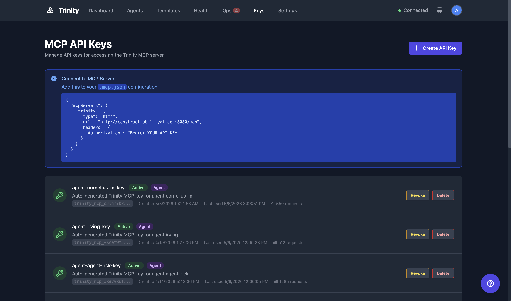

# MCP Server

Trinity's MCP server exposes ~107 tools across 27 modules for agent orchestration via the Model Context Protocol, enabling programmatic control from Claude Code, other MCP clients, or agent-to-agent communication. This is the community build; a few tools are enterprise-gated and return `"disabled"` where not entitled.

> 📺 **Watch:** [From Zero to Deployed AI Agent — MCP setup](https://youtu.be/-TSZyekDS6o) *(Apr 2026)* · [all videos](../videos.md)

## Concepts

- **Model Context Protocol (MCP)** — An open standard for tool-based AI integrations. Trinity implements an MCP server that exposes agent management as callable tools.
- **FastMCP** — The server framework used, with Streamable HTTP transport on port 8080.
- **API Keys** — Authentication mechanism for MCP access. Keys are generated in the API Keys page and sent via `Authorization: Bearer` header.
- **Agent-Scoped Keys** — API keys that restrict access to a specific agent, limiting which tools and data the key holder can reach.

## How It Works

### Authentication



1. Go to the **API Keys** page (`/api-keys`).
2. Click **Create Key**. Optionally scope the key to a specific agent.
3. Copy the generated key (prefixed `trinity_mcp_*`).
4. Use the key as a Bearer token in the `Authorization` header.

### Connecting from Claude Code

Add Trinity as an MCP server in your Claude Code configuration:

```json
{
  "mcpServers": {
    "trinity": {
      "type": "url",
      "url": "http://localhost:8080/mcp",
      "headers": {
        "Authorization": "Bearer <your-api-key>"
      }
    }
  }
}
```

### Tool Categories

| Module | Tools | Description |
|--------|-------|-------------|
| `agents.ts` | 22 | Agent lifecycle, credentials, SSH, local deploy, GitHub sync, per-agent PAT, runtime-data export/import, compatibility report |
| `chat.ts` | 4 | Chat (gateway-timeout safe), fan-out, history, logs |
| `schedules.ts` | 8 | Schedule CRUD and execution history |
| `executions.ts` | 3 | Execution queries, async polling, activity monitoring |
| `skills.ts` | 9 | Skill management and assignment, plus the skill-runner tools `run_skill` and `list_runnable_skills` (enterprise-gated — return `"disabled"` in community builds) |
| `tags.ts` | 5 | Agent tagging |
| `systems.ts` | 4 | System manifest deployment |
| `subscriptions.ts` | 6 | Subscription management |
| `monitoring.ts` | 3 | Fleet health |
| `nevermined.ts` | 4 | Payment configuration |
| `notifications.ts` | 1 | Agent-to-platform notifications |
| `events.ts` | 4 | Agent event pub/sub |
| `docs.ts` | 1 | Agent documentation |
| `channels.ts` | 2 | Channel group discovery + proactive group messaging (Telegram and Slack) |
| `messages.ts` | 1 | Proactive user messaging by verified email |
| `files.ts` | 1 | `share_file` — publish file to a signed download URL |
| `memory.ts` | 1 | `write_user_memory` — per-user memory blob, isolated server-side |
| `loops.ts` | 3 | `run_agent_loop`, `get_loop_status`, `stop_loop` — sequential bounded task loops |
| `voip.ts` | 1 | `call_user` — outbound phone call (flag-gated, requires a per-agent voice binding) |
| `operator_queue.ts` | 3 | `list_operator_queue`, `get_operator_queue_item`, `respond_to_operator_queue` — read and resolve Operating Room queue items |
| `reminders.ts` | 3 | `set_reminder`, `list_reminders`, `cancel_reminder` — durable one-shot deferred self-triggers |
| `rooms.ts` | 5 | `create_room`, `list_rooms`, `read_room`, `post_to_room`, `close_room` — multi-agent rooms (enterprise-gated — return `"disabled"` in community builds) |
| `git.ts` | 6 | Deterministic git operations — status, sync, log, pull, sync-state, and the destructive reset-to-main recovery |
| `pipelines.ts` | 2 | Read-only introspection of an agent's self-published pipelines |
| `reports.ts` | 1 | `report` — publish a structured report to the dashboard |

### Dedicated Agent Tools (Expose via MCP)

An owner can publish an agent as its own first-class MCP tool. On the agent's **Settings** tab, the **Expose via MCP** section has a toggle; when enabled, the MCP server registers a dedicated `chat_with_<slug>` tool (the slug is derived from the agent name, with a short suffix on name collisions — the resolved tool name is shown next to the toggle).

- No restart needed — the MCP server picks up the change on its next poll, and connected MCP clients see the tool appear (or disappear) within a few seconds.
- The tool behaves exactly like `chat_with_agent` with the agent name pre-filled, including idempotency and timeout handling.
- Exposure publishes the *tool*, not access: callers still need ownership or a share to actually chat with the agent.

| Endpoint | Method | Description |
|----------|--------|-------------|
| `/api/agents/{name}/mcp-exposed` | GET | Exposure flag + the resolved `tool_name` |
| `/api/agents/{name}/mcp-exposed` | PUT | Toggle exposure (`{"enabled": true}`, owner-only) |

### Key Tools Worth Knowing

| Tool | Why it exists |
|------|---------------|
| `chat_with_agent` | Send a message to another agent. **Gateway-timeout safe**: if the sync call exceeds `MCP_CHAT_TIMEOUT_MS` (default 25s), it returns `{status: "queued_timeout", agent, execution_id, message}` so the caller polls `get_execution_result` instead of duplicate-queueing the request. Calls also carry a deterministic idempotency key, so a transport-level retry of the same call dedupes server-side. |
| `run_agent_loop` | Run the same task against an agent repeatedly (bounded, sequential), with templated messages and an optional stop signal. Poll with `get_loop_status`; stop gracefully with `stop_loop`. See [Agent Loops](../automation/agent-loops.md). |
| `list_operator_queue` | Read the Operating Room queue (approvals, questions, alerts). Agent-scoped keys see only the calling agent plus its permitted agents. Resolve an item with `respond_to_operator_queue`. |
| `set_reminder` | Schedule a durable one-shot deferred self-trigger — the agent re-invokes itself later with a message it picks. Survives restarts; list with `list_reminders`, cancel with `cancel_reminder`. |
| `run_skill` | Run a named skill headlessly (enterprise-gated; returns `"disabled"` in community builds). Discover runnable skills with `list_runnable_skills`. |
| `create_room` | Open a shared multi-agent room and post/read messages (`post_to_room` / `read_room` / `list_rooms` / `close_room`). Enterprise-gated — returns `"disabled"` in community builds. |
| `call_user` | Place an outbound phone call to a user and hold a voice conversation. Server-gated: works only when VoIP is enabled platform-wide and the agent has a voice binding; rate-limited and daily-capped. See [VoIP Telephony](../advanced/voip-telephony.md). |
| `share_file` | The agent drops a file into `/home/developer/public/` and calls this tool to mint a signed, expiring download URL (universal — works for web, Slack, Telegram, WhatsApp, email). |
| `write_user_memory` | Per-user memory blob in an isolated store. Trinity resolves the user's email from `execution_id` server-side, so an agent cannot accidentally cross-write another user's memory. |
| `send_message` | Proactive message to a specific user by verified email. Rate-limited and audit-logged. |
| `send_group_message` | Proactive message to a channel group (Slack channel, Telegram chat). Discovered via `list_channel_groups`. |

## For Agents

### API Endpoints

| Endpoint | Method | Description |
|----------|--------|-------------|
| `/api/mcp/keys` | POST | Create API key |
| `/api/mcp/keys` | GET | List API keys |
| `/api/mcp/keys/{key_id}` | DELETE | Revoke API key |

### MCP Endpoint

| Endpoint | Transport | Description |
|----------|-----------|-------------|
| `http://localhost:8080/mcp` | Streamable HTTP | MCP tool server |

## Limitations

- Agent-scoped keys cannot access tools outside their assigned agent (plus explicitly permitted agents).
- MCP clients must be manually reconnected after a backend restart.
- `chat_with_agent` sync mode caps at `MCP_CHAT_TIMEOUT_MS` (default 25s). Long-running calls beyond that switch to poll-mode via the returned `execution_id`.

## See Also

- [Nevermined Payments](nevermined-payments.md)
- [Slack Integration](slack-integration.md)
- [A2A Protocol](a2a-protocol.md) — A2A `0.3.0` discovery and inbound tasking for external orchestrators
