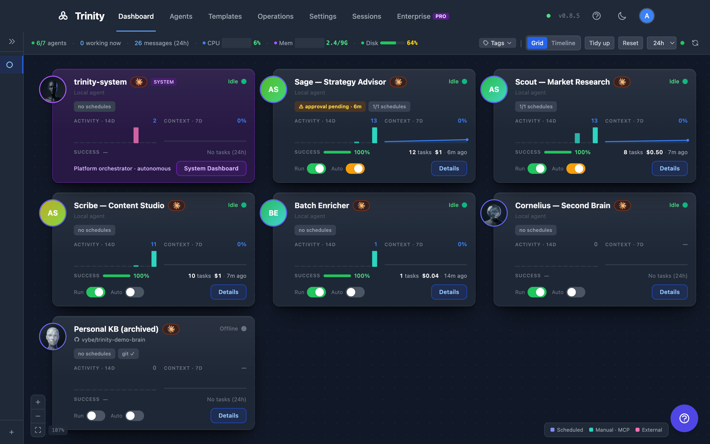

# Dashboard

The main Dashboard at `/` monitors all agents and their activities in real time. Switch between three view modes with the toggle in the top-right — **Timeline**, **Grid**, and **List**. Timeline is the default; your choice persists per browser in `localStorage['trinity-dashboard-view']`. (A previously saved mode that no longer exists — such as the retired `graph` view — falls back to the default.)

The Dashboard is also where you create agents: **Create Agent** sits in the header and is available in every view mode.

> 📺 **Watch:** [The Multi-Agent Platform I Run My Company On](https://youtu.be/8j6q-kABRqc) *(May 2026)* · [all videos](../videos.md)

## Concepts

| Term | Meaning |
|------|---------|
| **View mode** | Timeline, Grid, or List — three renderings of the same fleet. Switching modes never refetches or resets your filters. |
| **Agent tile** | One agent's card on the Grid canvas — avatar, runtime badge, live chips, and inline Run/Autonomy toggles. |
| **Info tile** | A fleet-level readout that shares the Grid canvas with agent tiles. It summarizes; it never operates an agent. |
| **Department** | A visual grouping of agents on the Grid canvas, backed by a `dept-<name>` tag. |
| **Reporting line** | An arrow between two tiles on the Grid, backed by a `reports-to-<agent>` tag on the reporting agent. |

## How It Works

### Filtering (all three modes)

Filters live in the Dashboard header and apply to every view mode:

- **Type-to-filter** — Press `/` anywhere on the page and start typing to narrow the fleet by name. Matching is a case-insensitive substring over both the agent slug and its display name. Press `Esc` to clear. This filter is an accelerator, not a saved preference — it is never persisted and clears when you leave the page. It narrows *agents* only: Grid info tiles are fleet-scope readouts and keep reporting on the whole fleet regardless of the query.
- **View-mode shortcut** — Press `v` to cycle Timeline → Grid → List (the switcher's tooltip names it). The choice is saved exactly as if you had clicked the switcher.
- **Quick tag filter** — Narrow to one or more tags.
- **Owner filter** — Narrow to agents owned by a particular user.
- **Time range** — 1h, 6h, 24h, 7d, or custom (Timeline).

When a type-to-filter query matches nothing, the Dashboard tells you so explicitly rather than showing an empty fleet.

### Timeline View (default)

1. Execution boxes per agent, arranged chronologically.
2. Color-coded by trigger type: Manual (green), MCP (pink), Scheduled (purple), Agent-Triggered (cyan), Paid (yellow), Public (teal).
3. Each row shows the agent's completion rate, total cost, and parallel slot count.
4. Live streaming: running executions show progress in real time with a "Live" indicator.
5. **Active only** toggle hides agents with no recent activity.
6. **Jump to Now** snaps the view to the current time.

Agent-to-agent collaboration is surfaced here — via the Agent-Triggered trigger type — rather than as a live node graph.

### Grid View

A magnetic tile canvas. It holds two kinds of occupant on one lattice: **agent tiles** (one per agent) and **info tiles** (fleet-level readouts). Each agent is a five-zone tile showing its avatar, runtime badge, and inline **Running** and **Autonomy** toggles, plus live status chips (git sync health, pending operator-queue items).

1. Drag a tile to move it; drop it onto another tile to **swap** positions. The layout snaps to an unbounded lattice.
2. **Tidy** re-packs the tiles into a compact arrangement without losing your ordering.
3. **Reset** restores the default auto-generated layout, then re-seeds your enabled info tiles above the fleet.
4. Pan by dragging the background; zoom with the scroll wheel or pinch. Tiles are keyboard-navigable.
5. Tile metrics hydrate lazily as they scroll into view, so large fleets stay responsive.

Everything in that list applies to info tiles too — they drag, swap, tidy, and take keyboard focus exactly like agent tiles.

**What persists, and where.** Two independent browser-local keys: tile positions in `localStorage['trinity-grid-layout-v2']` (migrated once from the older v1 layout, which is left intact), and which info tiles you show in `localStorage['trinity-grid-widgets-v1']`. Because they are separate, resetting your tile selection can never disturb your layout or the org-overlay toggles. Both are per browser, not per account — a different machine starts from the defaults.

#### Info tiles

Info tiles put fleet-level answers on the same canvas as the fleet. They are deliberately easy to tell apart from an agent: a **square** peg badge on the left edge instead of a round avatar, no Run or Autonomy toggles, and no connect port — an info tile can never join a department or terminate a reporting line.

Two ship today, both on by default and visible to any user:

| Tile | Shows | Opens |
|------|-------|-------|
| **Fleet summary** | Running (`n/total`), Autonomous, and Stopped counts, with the fleet size in the header | The fleet in List view |
| **Recent failures** | The 4 newest failed executions across every agent you can access — agent, trigger, age, and the truncated error — plus the 24-hour failure total in the header | The Executions tab; each row opens that execution's detail page |

**Showing and hiding them.** A **Tiles ▾** button sits on the Grid canvas itself, top-right, just below the org-overlay controls (Zones · Lines · Group by dept · New dept). It is Grid-only — you won't find it in the Dashboard header or the other two view modes. Tick a tile to show it, untick to hide it, and use **Reset to defaults** at the bottom to restore the default set. Close the menu with `Esc`, by clicking the button again, or by clicking anywhere else on the canvas.

Because the show/hide store records only your explicit choices, a tile added in a later release appears automatically, while one you deliberately hid stays hidden.

**How they refresh.** Info tiles ride the Grid's existing 60-second fleet poll — no extra load, and no request at all for a tile you have switched off. The poll pauses while the browser tab is hidden and refreshes immediately when you return to it, so a tab left open overnight never greets you with a stale all-clear. Enabling a tile fetches straight away rather than waiting for the next tick, and the header refresh button forces a round.

**Failures are contained and claims are honest.** If one tile's data can't be read, only that tile shows an error — with a **Retry** button — and the rest of the board stays live. A failed *refresh* over data already on screen keeps the last good numbers rather than blanking them.

The **Recent failures** tile treats "no failures" as a claim that needs evidence, so it shows the green **No failures in 24h ✓** only when it can positively confirm one. If the fleet list can't be enumerated, or the 24-hour total can't be read, it says exactly that instead of implying an all-clear. And when the 24-hour count is above zero while the latest page is empty — older failures, or legacy rows the list filters out — it explains the discrepancy rather than showing a checkmark beside a non-zero number.

#### Org overlay — departments and reporting lines

The Grid can render an organizational layer on top of the same lattice, so a fleet reads like an org chart instead of a flat pile of tiles.

- **Departments** are drawn as labelled zones around their member tiles. Each department gets its own color, and members carry a matching ribbon on their tile.
- **Reporting lines** are drawn as arrows between tiles. The arrow points from the reporting agent to the one it reports to.
- **Assign by drag** — drop a tile into a zone to move it into that department, or use **New department** mode to create one and assign members.
- **Draw a line** — drag from a tile's connect port onto another tile to create a reporting line. A live pill previews the relationship before you drop.
- **Move a department** — drag its zone header to relocate the whole group.
- Every org change surfaces a canvas toast with **Undo**.

Both are stored as ordinary agent tags — `dept-<name>` for departments, `reports-to-<agent>` on the *reporting* agent for lines — so nothing new is persisted and you can inspect or bulk-edit them from the tag surfaces. Zones are derived from where tiles already sit; they never constrain your layout. If an agent is renamed, its reporting references follow; if it is permanently purged, dangling references are cleaned up.

Org tags are **human-only**: agent-scoped API keys cannot add or remove them.

### List View

The former standalone Agents page, folded into the Dashboard as a third mode (`/agents` now redirects here).

1. One row per agent: name, status, tags, runtime, read-only state, and last activity.
2. **Run** and **Autonomy** toggles inline on each row.
3. Sort by name, status, or activity; filter by name and status. These two filters persist per browser.
4. Select multiple rows for bulk tag operations.
5. Three responsive layouts — the row list reflows down to mobile widths.
6. System agents pin to the top and hide the Run toggle.

Tag and owner filtering use the shared Dashboard header controls; **Clear all** clears both the row-level and header-level filters at once.

### Tag Clouds

Agents are grouped visually by tags on the Dashboard. Click a tag cloud to filter the view to that group.

### Activity Feed

A real-time WebSocket-driven activity stream showing agent collaborations, task starts/completions, schedule executions, and errors.

### Fleet stats bar

The header carries live fleet telemetry (agent counts, running executions, cost). On narrow viewports it degrades gracefully — dropping the least important readouts — rather than clipping.

## For Agents

| Endpoint | Method | Description |
|----------|--------|-------------|
| `/api/agents` | GET | List all agents (carries `tags`, `read_only_enabled`, and `display_label` per row) |
| `/api/agents/context-stats` | GET | Context and activity state for all agents |
| `/api/agents/autonomy-status` | GET | Autonomy status for all agents |
| `/api/activities/timeline` | GET | Cross-agent activity timeline (filterable) |
| `/api/executions` | GET | Recent executions — the Recent-failures tile reads it with `status=failed&hours=24` |
| `/api/executions/stats` | GET | Windowed fleet totals — the source of the tile's 24-hour failure count |
| `/api/executions/timeline` | GET | Bucketed fleet rollups for building your own readouts — see [Executions](executions.md) |
| `/api/agents/{name}/tags` | PUT | Set an agent's full tag list — including `dept-*` and `reports-to-*` org tags. Rejected for agent-scoped keys. |
| `/api/telemetry/host` | GET | Host CPU/memory/disk |

**API Endpoints**: See [Backend API Docs](http://localhost:8000/docs) for full schemas.

## Limitations

- The org overlay renders departments as hulls around wherever tiles already sit — it does not auto-arrange your fleet into an org tree (though **Tidy** groups by department when the overlay is active).
- Reporting lines to an agent that is not currently placed on the canvas are skipped rather than drawn to an off-screen point.
- The live agent-to-agent node graph was retired; collaboration is visible through the Timeline instead.
- Info tiles come from a fixed catalog — there is no affordance for building a custom tile, and every tile occupies exactly one cell.
- **Recent failures** shows at most four rows and never scrolls; use the Executions tab for the full list.
- Grid layout and info-tile selection are stored in your browser, so they do not follow you to another machine.

## See Also

- [Managing Agents](../agents/managing-agents.md)
- [Tags and Organization](../sharing-and-access/tags-and-organization.md) — the tag model behind departments and reporting lines
- [Scheduling](../automation/scheduling.md)
- [Operations Page](operating-room.md) — Operator queue, health, and fleet executions
- [Executions](executions.md) — Fleet execution list and completion metrics
