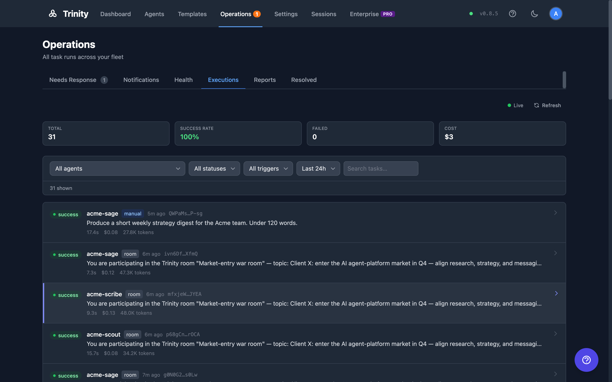
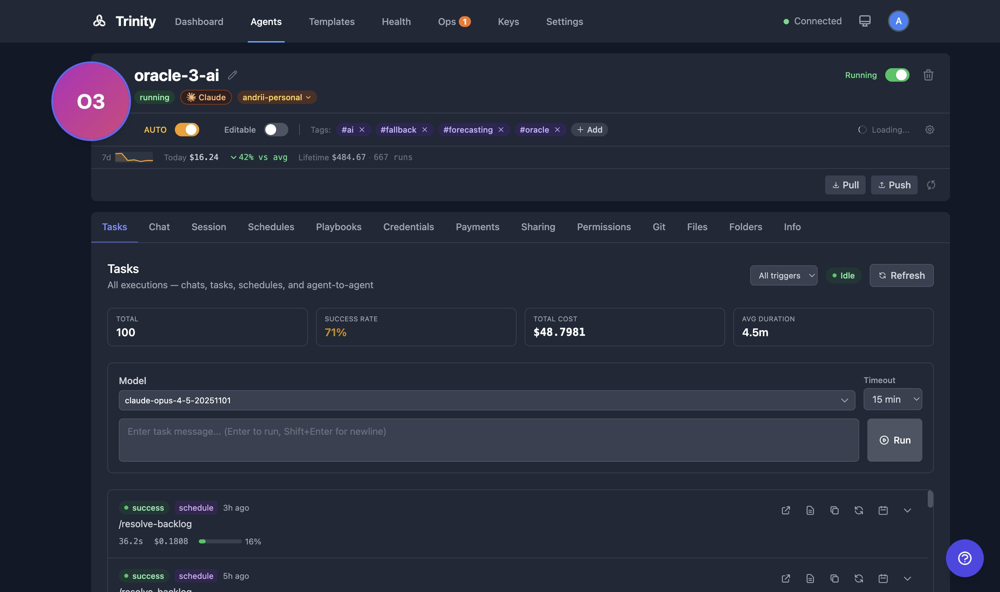

# Executions

View, monitor, and manage task executions across all agents. Executions are created by manual tasks, schedules, MCP calls, and chat interactions.

## Concepts

**Execution** -- A single run of a task on an agent. Each execution records: status, started_at, completed_at, duration, message, response, error, cost, model_used, triggered_by, and claude_session_id.

**Trigger Types** -- How an execution was initiated:

| Trigger | Source |
|---------|--------|
| `manual` | Tasks tab in agent detail |
| `schedule` | Cron-based schedule |
| `chat` | Chat tab in agent detail |
| `session` | A resumable conversation turn (the Workspace) |
| `agent` | Agent-to-agent call |
| `mcp` | MCP client call |
| `public` | Public chat link |
| `webhook` | Webhook trigger URL |
| `fan_out` | Fan-out to multiple agents |
| `loop` | Sequential agent loop iteration |
| `reminder` | An agent's own deferred self-trigger |
| `room` | A turn inside a shared multi-agent room |
| `a2a` | A task sent in by an external A2A orchestrator |

Channel and voice triggers (`telegram`, `slack`, `whatsapp`, `voip`, `voice`, `paid`) are recorded too and are folded into the **Channels**, **Voice**, and **Public** groups on the analytics charts.

**Execution Status** -- Every execution moves through a lifecycle: `queued` -> `running` -> `success`, `failed`, `cancelled`, or `skipped`, with `pending_retry` in between when a run is awaiting an automatic retry. A run you stop yourself terminates as `cancelled` — a distinct state, not a failure: it has its own filter option and badge in the Executions list, and renders neutral (not red) on the activity timeline. Some long-lived installs still carry historical rows with a legacy `error` status; the fleet stat cards count those alongside `failed`.

**Parallel Capacity** -- Each agent has a configurable slot system (default: 3 concurrent slots). Slot TTL equals the agent timeout plus a 5-minute buffer. When all slots are occupied, new executions queue until a slot frees up.

**Task Execution Service** -- A unified execution lifecycle layer used by all callers (UI, schedules, MCP, chat, paid). Handles slot management, activity tracking, and input sanitization.

**Live Streaming** -- Running executions stream logs in real time via Server-Sent Events (SSE) to the Execution Detail page.

## How It Works

### Executions Tab (Operations Page)

The fleet execution list lives on the **Executions** tab of the [Operations page](operating-room.md) (`/operations?tab=executions`). The legacy `/executions` route redirects there.

1. Lists all executions across the fleet. Admins see every agent; other users see only agents they own or that are shared with them.
2. Stat cards show Total, **Completion**, and Cost for the selected time window. Running and queued counts are always live, regardless of the window.
3. Filter by agent, status, trigger type, time range (1h to 30d, or all time), and free-text search over task messages.
4. The list loads 50 rows at a time; **Load more** appends the next page.
5. A "N running now" strip appears whenever executions are in flight.
6. A status dot shows **Live** when WebSocket updates are connected, or **Polling** (every 30s) as fallback.
7. Click any execution row to open its detail page (`/agents/{name}/executions/{id}` — this route is unchanged).

### Completion is not quality

"Completion" means the run finished cleanly — the process exited without error. It says nothing about whether the work was any good. That is a separate axis, recorded as an **evaluation**.

Evaluations are written by the platform or by a human admin — never by the agent being graded, which is the entire point of keeping them apart from [reports](agent-reports.md) (an agent publishes its own reports). An ungraded run has no quality score at all; that is different from scoring zero.

An agent can read its own evaluations — seeing its own bad score is the feedback loop. Only humans with admin rights can write one.

### Execution Detail Page

1. Displays agent name, status, timestamps, duration, cost, model used, and trigger source.
2. Shows who or what initiated the run, including scheduler-triggered executions.
3. Shows the full transcript/log of the execution.
4. **Tool calls** are recorded as a summary — which tools ran and how often — not as a second copy of the transcript.
5. For running executions, a green pulsing "Live" indicator streams output in real time.
6. **Stop** button terminates a running execution.
7. **Continue as Chat** button resumes the execution as an interactive chat session.

Durations are always non-negative, and a run that ends through a recovery path (a timeout, a restart, an expired lease) closes its activity record with a real duration rather than being left open until a sweep guesses one.

### Tasks Tab (per-agent)

1. Open agent detail and click the **Tasks** tab.
2. Enter a task message. Optionally select a model.
3. Click **Send** to start the execution.
4. View execution history with status and duration.
5. A green pulsing "Live" badge links directly to the running execution.
6. Use **Make Repeatable** to create a schedule from any completed task.

### Execution Termination

- Stop running executions via the **Stop** button on the detail page.
- The system sends SIGINT first, then SIGKILL if the process does not exit.
- Queue slots are released and activity is tracked.

## For Agents

### API

| Endpoint | Method | Description |
|----------|--------|-------------|
| `/api/executions` | GET | Fleet execution list. Filters: `status`, `triggered_by`, `hours` (0 = all-time), `agent`, `search`; `limit` (max 200, default 50), `offset` |
| `/api/executions/stats` | GET | Fleet stat cards: total, success/failed counts, total cost for the `hours` window; running and queued counts always live |
| `/api/executions/timeline` | GET | Bucketed fleet rollups for charts. `group_by` = `hour`\|`day`\|`trigger`\|`agent` (default `day`); `hours` ∈ {0, 1, 6, 24, 168, 720} (default 168); optional `agent`. Each bucket carries total, success, failed, cost, and context use |
| `/api/agents/{name}/executions` | GET | List executions for an agent |
| `/api/agents/{name}/executions/{id}` | GET | Get execution details |
| `/api/agents/{name}/task` | POST | Submit a new task |
| `/api/agents/{name}/evaluations` | GET | Read an agent's quality evaluations (access-scoped) |
| `/api/agents/{name}/evaluations` | POST | Write an evaluation (admin **and** human-only — an agent can never grade itself) |

Access control on the fleet endpoints mirrors the UI: admins see everything; other users see only owned or shared agents.

The `success_rate` field name is unchanged in the API — only the UI label moved to "Completion".

Full API reference: http://localhost:8000/docs

### MCP Tools

| Tool | Description |
|------|-------------|
| `list_recent_executions(name)` | List recent executions for an agent |
| `get_execution_result(id)` | Get the result of a specific execution |
| `get_agent_activity_summary(name)` | Get activity summary including execution stats |

## See Also

- [Operations Page](operating-room.md) -- The tabbed view that hosts the Executions tab
- [Agent Reports](agent-reports.md) -- Structured results an agent publishes about its work
- [Scheduling](../automation/scheduling.md) -- Automate recurring executions with cron
- [Agent Chat](../agents/agent-chat.md) -- Interactive chat sessions with agents
- [Monitoring](monitoring.md) -- Fleet-wide health and activity monitoring
