# What's New in Trinity v0.9.0

*Released 2026-08-17 · 499 commits · 155 public + 62 private-tracker issues*

*▶ The [hosted What's New page](https://docs.ability.ai/whats-new/v0.9.0) includes a 42-second animated tour of the release's headline flow.*

Trinity's biggest release yet is about **opening the platform outward**. **Workspace** — the client-facing surface — moves into every build, with multi-agent conversations, an agent page per agent, and streaming replies. A fresh install now provisions itself: agent templates arrive from a remote registry, whole multi-agent systems install from a manifest in the UI, and a guided checklist walks each agent's credentials. The skills library becomes multi-source, A2A becomes bidirectional, the dashboard learns to draw your org chart, Agent Reports are complete, and the platform starts backing up its own database nightly — alongside one of the deepest security hardening passes Trinity has shipped.

Beneath the individual features runs one theme: **structure**. This release introduces a new level of organization into agentic systems — the primitives agents need to **collaborate**: departments and reporting lines on the platform side; canon, orchestration, playbooks, project management, and guided creation on the marketplace side — and a much tighter integration between the two, with the multi-source skills library serving marketplace skills straight into your fleet.

## Improvements

### The fleet is the org chart

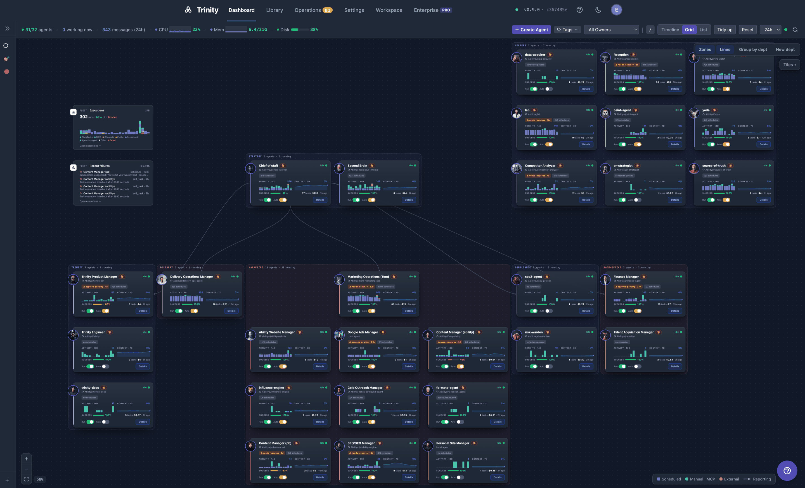

The Grid view gains an **org overlay**: departments render as labelled zones around their member tiles and reporting lines as arrows between them — drag a tile into a zone to reassign it, all stored as ordinary agent tags, so nothing new to migrate or back up. A new **widget chassis** puts fleet-level data tiles on the same canvas — **Executions by trigger** (hourly chart over the last 24h) and **Recent failures** (latest failed runs fleet-wide, with the 24h total). The standalone Agents page folded into a dashboard **List view** (Timeline · Grid · List, old routes redirect), and `/` type-to-filter works across all three views.

### Workspace — the client surface, now in every build

The client portal moved from an enterprise module into **OSS core** and became **Workspace**: one click from the platform, a sidebar with your agents, starred and dated chats, and **an agent page per agent** — what it's been doing, its reports and files, and what it needs from you. Chats stream as they happen, sessions renew on activity instead of expiring mid-conversation, and the composer understands `/` for the agent's playbooks and `@` for agents. Start a chat with **one or several agents**, or `@mention` another agent mid-chat to bring it in. Clients sign in with an emailed one-time code, sign-out really signs out, and per-client rate limits keep the surface safe to share. The old Sessions page and Session tab are retired — Workspace absorbed them.

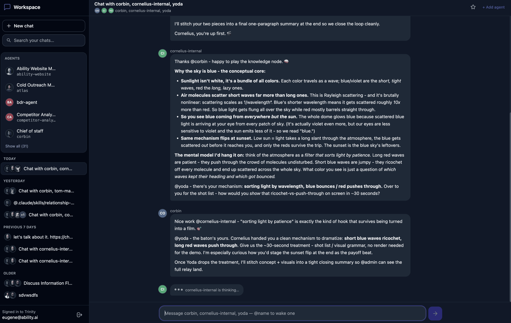
*A multi-agent Workspace chat: one agent frames the task, the second supplies the concept, the third takes the baton — in a single shared thread.*

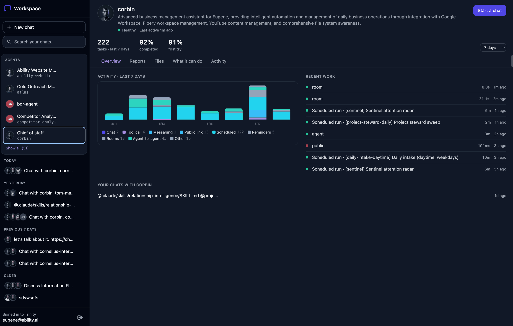
*Every agent gets a Workspace page: health, task count, completion and first-try rates over a 7/14/30-day window, its activity mix, and recent work — reporting without operator controls.*

### Provisioning from zero

The agent catalog now resolves through a **remote template registry** that updates without upgrading Trinity — new starter templates appear in your Library on the next fetch, with live registry status in Settings. A **GitHub-repo import wizard** turns any repository into an agent — fork it, copy it, or clone your own, and a public repo needs **no PAT at all** — with an inline compatibility check before anything is created. Whole multi-agent systems **install from a manifest in the UI**: pick a bundled one, upload a file, or paste YAML, and a dry-run preview shows every agent, permission edge, and schedule it would create before anything runs. Guided **per-agent credential setup** shows a required-credentials checklist with live set/missing status and how-to-get instructions, schedules declared in `template.yaml` are materialized at creation, and you can **bind an existing agent to a repo you own** after the fact from its Git tab.

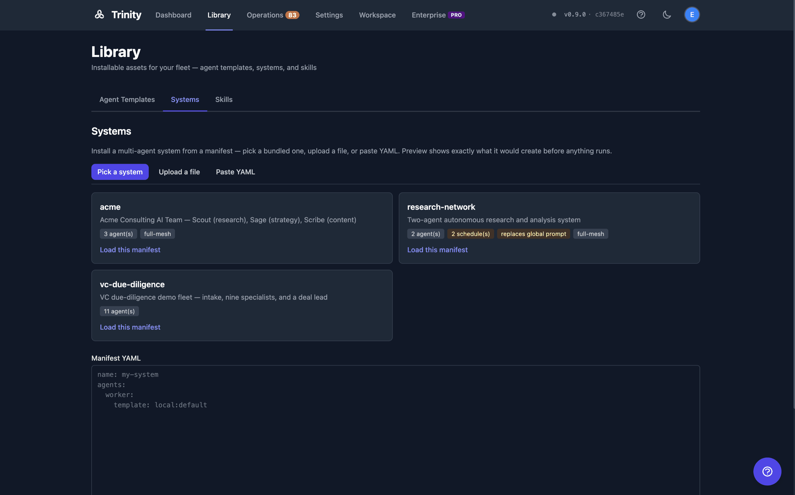
*Library → Systems: install a multi-agent system from a manifest — bundled cards show agent counts and warning badges (schedules, global-prompt replacement) before anything is created.*

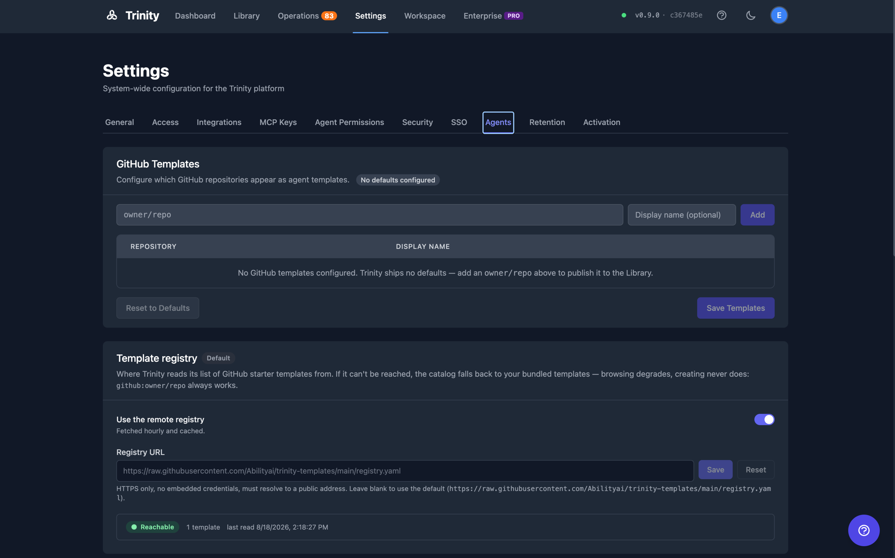
*Settings → Agents: the template catalog is fed by a remote registry (fetched hourly, cached, falls back to bundled templates when unreachable) plus any GitHub repos you add yourself.*

### A multi-source skills library, managed for the whole fleet

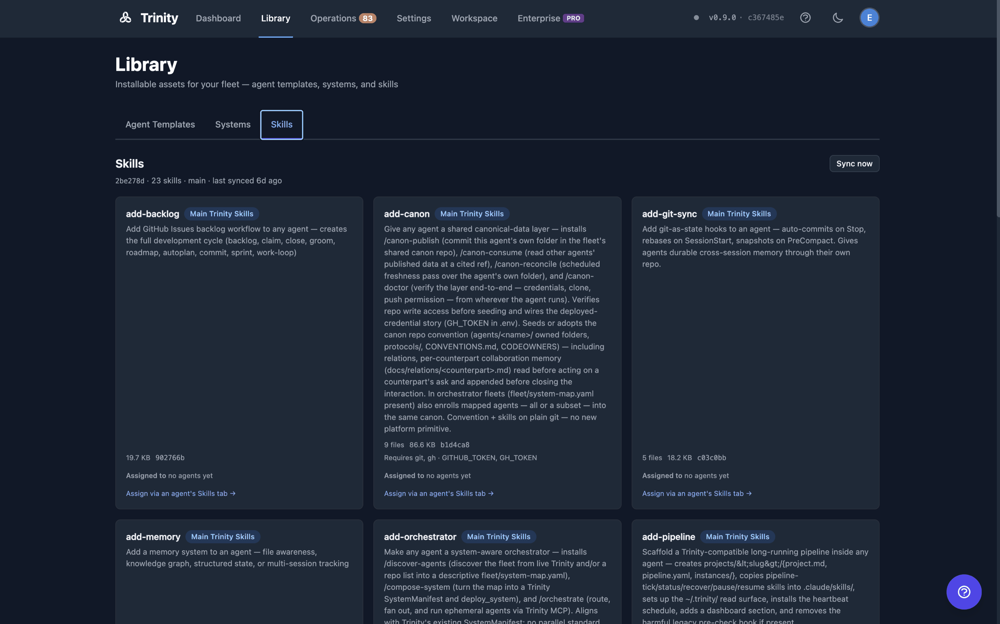

The Templates page is now **Library** — one surface for agent templates, systems, and a tabbed Skills section that shows **which agents hold each skill**. The library itself syncs from **multiple sources** — a bundled, tag-pinned community catalog plus your own repositories (your repo always wins a name clash, so names stay bare) — and its lifecycle is automated: scheduled auto-sync, fleet-wide re-inject when the library moves, and removal-on-unassign. Distribute, place, expose — one model.

### Inside one agent

Agent Detail stays the operator's view of the whole agent — repo + CLAUDE.md + skills + cron + credentials + volume — and this release rebuilds two of its panels. The **Skills tab** is new from the ground up: browse the library, tick to assign, save, and read an honest per-skill injection status (installed, withheld with a named reason, or pending the next sync). And agent **MCP keys** become first-class — visible, verifiable against what the container actually holds, regenerable, and self-healing — instead of something you discover when it breaks.

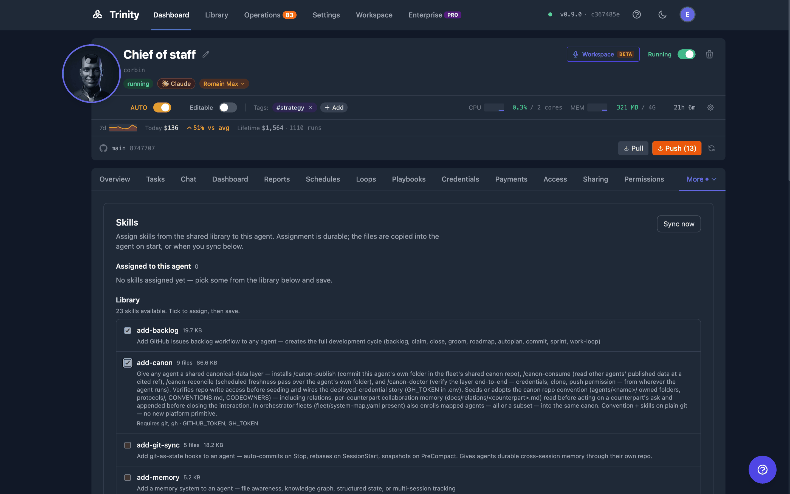

### The plugin marketplace: primitives for organized fleets

The platform work has a mirror in the [abilities](https://github.com/abilityai/abilities) plugin marketplace, which now covers the whole arc of an agentic system — create it, extend it, organize it, and let its agents collaborate:

- **Start here** — `/trinity:start-here` is a guided, resumable journey from "what is Trinity?" to your first agent alive on your own instance. Answers come from live documentation, not a script.
- **Fleet analysis and migration** — `/agent-dev:agent-fleet-analysis` scans directories of agents in *any* paradigm — Claude Code, n8n exports, LangChain/CrewAI/AutoGen apps, freeform-coded loops — scores their maturity, maps every gap to an installable marketplace skill, and emits a work order that `/agent-dev:agent-fleet-migrate` executes as a non-destructive, verified migration.
- **Canon** — `add-canon` gives a fleet a shared canonical-data layer — each agent publishes the facts others may rely on, with publish/consume/reconcile/doctor skills — and `add-canon-lint` makes it deterministic: a two-zone schema, linted in CI on every push.
- **Orchestration** — `add-orchestrator` makes any agent system-aware: discover the fleet, compose systems aligned with Trinity's SystemManifest, and route and fan out work.
- **Project management** — `add-project-management` installs cross-actor project management — GitHub Issues as the single source of truth and an approval-ready completion lattice.
- **Creation and playbooks** — the `create-agent` wizards scaffold new Trinity-compatible agents, and `/agent-dev:create-playbook` turns a working procedure into a reusable skill.

And the loop closes inside the platform: the multi-source skills library above serves these same marketplace skills to your fleet — browse them in Library → Skills, assign them from an agent's Skills tab, and let library automation keep them synced. New agents also boot with the Trinity plugin **pre-installed**, so a bare repository can onboard itself in place.

### Agent Reports, complete

The reports epic closes: agents get **prompt guidance** on when and how to publish (reporting is now a fleet-wide default, not a per-template opt-in), **Excel and PDF export**, large payloads page instead of choking the browser (5 MiB cap, row-windowed table reads), agents **read back their own reports over MCP** so a series can continue instead of duplicating, and both the fleet and per-agent views gain search and filters. Reports also render on the Workspace agent page — with a bounded, client-safe fallback instead of raw JSON.

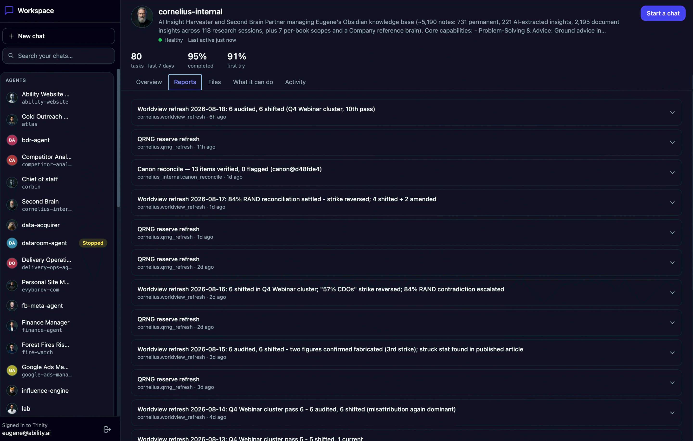
*Reports read like a feed of the agent's work — each entry expands into a typed viewer (table, KPI, markdown, timeline), exportable to Excel or PDF.*

### Agents talking outward — A2A in both directions

Trinity agents can now be **tasked from outside** over the open A2A protocol: per-agent opt-in exposure publishes a public Agent Card and a JSON-RPC/SSE task endpoint, configured from a dedicated panel — card URL, advertised skills, inbound allow-list — or over MCP. And they can call outward: the new `call_a2a_agent` tool tasks external A2A agents from an operator-registered endpoint list (registered by an admin, never a raw URL from the agent — so a prompt-injected agent can't be steered into calling arbitrary hosts).

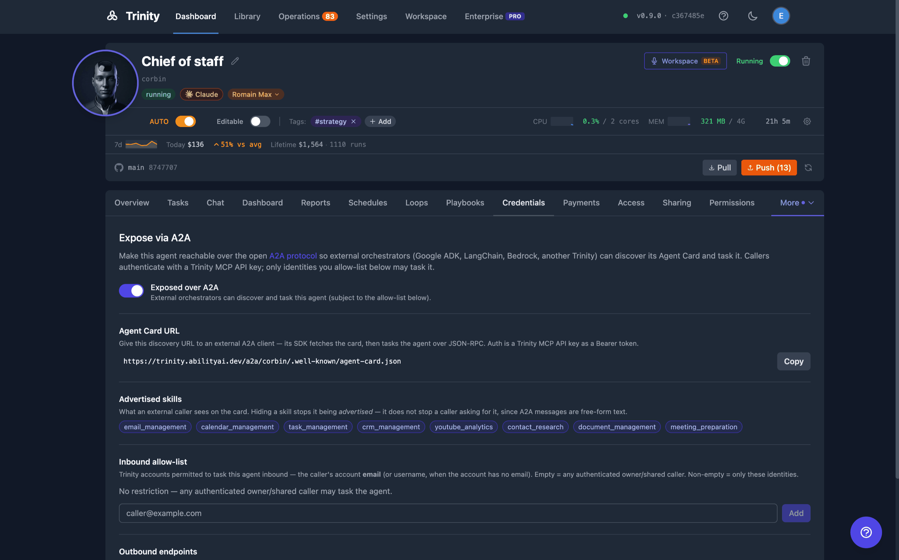
*Expose via A2A: flip the toggle, hand out the Agent Card URL, curate the advertised skills, and optionally pin an inbound allow-list — external orchestrators (Google ADK, LangChain, Bedrock, another Trinity) can then discover and task the agent.*

### A second model checks the work (foundation)

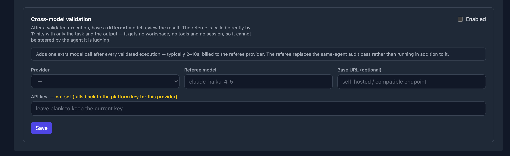

After a validated execution, a **different model** can review the result. The referee is called directly by Trinity with only the task and the output — it gets no workspace, no tools, and no session, so it cannot be steered by the agent it is judging. This lands alongside the behavioral-evaluation referee surface (quality scores an agent cannot write about itself) as the foundation for agent evaluations; graders and richer read surfaces follow.

### Ops: the platform keeps itself recoverable

Trinity now takes **automatic nightly database backups** — verified recovery points for both SQLite and PostgreSQL under `~/trinity-data/backups/`, plus a pre-migration copy whenever an upgrade is pending. Container logs are **bounded**, closing the class of disk-full failures that could wedge Docker itself. Rebuilt agent base images are now **actually adopted** — on cold start, on fleet restart, and by the system agent — instead of silently running stale. And the self-monitoring canary harness runs against production, elects one leader, names the instance that fired an alert, and retries lost Slack alerts.

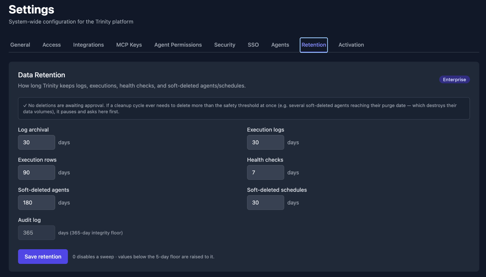
*Settings → Retention: every data window in one panel — and the approval gate above it. A cleanup cycle that would delete more than the safety threshold pauses and asks here first.*

### More improvements

- **Ask Trinity from any agent** — the `ask_trinity` MCP tool answers platform questions from live documentation, for agents and external MCP clients alike.
- **ZIP uploads in chat** — send an archive over Slack, Telegram, WhatsApp, or the web and the agent receives it.
- **Channels feel alive** — Telegram shows an in-progress indicator while a task runs, and a long-running task **reports back to the chat it came from** when it finishes.
- **One model catalog** — the selectable model list has a single source of truth across every picker, and the Codex runtime prices current GPT-5.x models correctly.
- **A calmer dark theme** — the scanline data-loading motion language, a dark ink-ladder readability sweep, and the design system's seven base primitives.

## Fixes

- **Schedules are honest** — schedules and self-reminders on a non-autonomous agent are surfaced as *held* (with a live countdown) instead of silently skipped, toggling autonomy no longer erases per-schedule enabled intent, and a suppressed cron tick always leaves an execution record.
- **No more silently missing MCP servers** — `github:` agents finally render `.mcp.json.template`, and plugin install-state survives container recreation via a committed, self-healing manifest.
- **Credentials behave** — a credential removed from `.env` stops reaching the next execution, quoted values round-trip uncorrupted, and global PAT rotation reaches every agent.
- **Workspace polish sweep** — roster availability states, faster agent-page loads, readable chat spacing, working voice mode, real execution timeouts instead of a hard 300-second cap, and reports rendered with proper viewers instead of raw JSON.
- **Failures are visible** — fetch failures render as errors instead of empty states, a non-existent agent page says so instead of rendering blank, and completed turns are no longer discarded on execution errors.
- **WhatsApp media works again** — the SSRF allowlist no longer rejects Twilio's own CDN.
- **Timezones don't crash** — legacy IANA aliases (`Europe/Kiev`, …) no longer 500 schedule creation, and agents no longer run four hours off UTC on a hardcoded `TZ`.
- **Log archival runs again** — a permissions wedge left archives root-owned; expect a backlog to be reclaimed on the first pass after upgrade.

## Security & Hardening

- **Admin gates reject agent keys** — `require_admin`/`assert_admin` now refuse agent-scoped principals at the chokepoint — the root cause behind four prior privilege escalations, closed once instead of endpoint by endpoint.
- **Hardened YAML everywhere** — every place author-controlled YAML is parsed now resists anchor/alias expansion and duplicate keys, and a path-traversal in template resolution is fixed.
- **Tokens stay secret** — PAT scrubbers catch the URL shapes they under-matched, and the orphan sweeper no longer logs process command lines verbatim.
- **SSRF sweep** — Slack and WhatsApp media downloads validate their destinations, and the CGNAT range is covered on every outbound path, including A2A and the template registry.
- **Workspace sign-in is hardened** — brute-force protection on OTP sign-in, no client enumeration through response timing, and per-client inbox isolation.
- **The audit log holds its chain** — the tamper-evident hash chain survives backend restarts, and verification can no longer report valid on zero rows checked.

## Enterprise

Available on the enterprise tier:

- **Multi-agent Workspace chats** ride the shared-rooms engine — the several-agents picker and mid-chat `@mention` recruiting appear only on entitled builds; single-agent Workspace chat is in every build.
- **Delegated identity** — a trusted customer backend can act as an end user via token exchange, so an operator's own product can embed Workspace conversations.
- **Compliance audit export** — an auditor-facing pull API over the platform audit log.

## Upgrade Notes

- **Rebuild the platform images** — all four platform Dockerfiles changed (the backend now bakes the PostgreSQL client for backups): `docker compose build` before `start.sh`. `GET /api/version` reports both the code in service and the image it runs in — if they differ, the image is stale.
- **Rebuild the agent base image, then restart agents** — and unlike v0.8.5, adoption now propagates: a cold stop/start detects the rebuilt image and recreates the container, as does Restart All.
- **The template catalog fetches a remote registry by default** — a new outbound fetch (byte-capped, SSRF-validated, fails open to the bundled catalog). Air-gapped installs: set `TEMPLATE_REGISTRY_ENABLED=false` or use the Settings override.
- **Automatic database backups are ON** — nightly at 03:30 UTC under `~/trinity-data/backups/`, 14-day retention — budget disk accordingly. Same-disk scope: this protects against corruption and bad migrations, not disk loss. `DB_BACKUP_ENABLED=false` disables.
- **Automation using an agent's MCP key for admin endpoints breaks** — by design. Switch it to a user-scoped key; agent self-check flows are unaffected.
- **Skills settings migrate** — the single skills-library URL becomes a multi-source table; an existing URL is adopted as a custom source, and moved tag pins are refused, never silently adopted.
- **Navigation moved (old routes redirect)** — Templates → **Library**, the Agents page → the Dashboard **List view**, and the Session tab, Sessions page, and Client Portal → **Workspace**.
- **Enterprise instances**: bump the enterprise submodule pin to `65182c1` — earlier pins silently degrade entitled PostgreSQL instances to OSS-only.
- **Re-login** after upgrading (sessions rotate on backend restart) and **reconnect** MCP clients. Carried forward: SQLite support ends **September 1, 2026** — PostgreSQL is the forward path.

## Known Limitations

- **Agent evaluations ship as a foundation** — the referee surface and cross-model validation are live; graders and agent/UI read surfaces follow.
- **A2A cards are unsigned** — inbound exposure is per-agent opt-in; outbound `call_a2a_agent` is default-OFF behind an admin-managed endpoint registry.
- **Workspace multi-agent chats** are entitlement-gated (see Enterprise above) — the picker hides itself on builds without it. Workspace exposure config is API-only for now.
- **The skill runner** still has no admin surface — enable and sync via MCP/API only.
- **Grid data tiles** — Executions and Recent failures shipped; Next schedules did not.

## See Also

- [Workspace](../sharing-and-access/workspace.md)
- [Dashboard](../operations/dashboard.md) — the org overlay and data tiles
- [Building Agents](../guides/building-agents.md) — templates, the import wizard, and credential setup
- [Skills and Playbooks](../automation/skills-and-playbooks.md) — the multi-source library
- [Agent Reports](../operations/agent-reports.md)
- [System Manifest](../collaboration/system-manifest.md)
- [Abilities Marketplace](../automation/abilities-marketplace.md)
- Full technical record: [docs/releases/0.9.0.md](../../releases/0.9.0.md)
